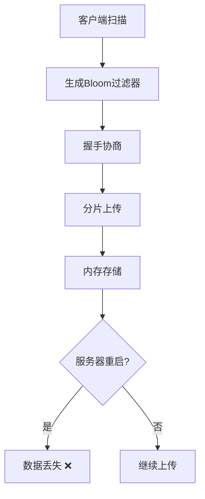
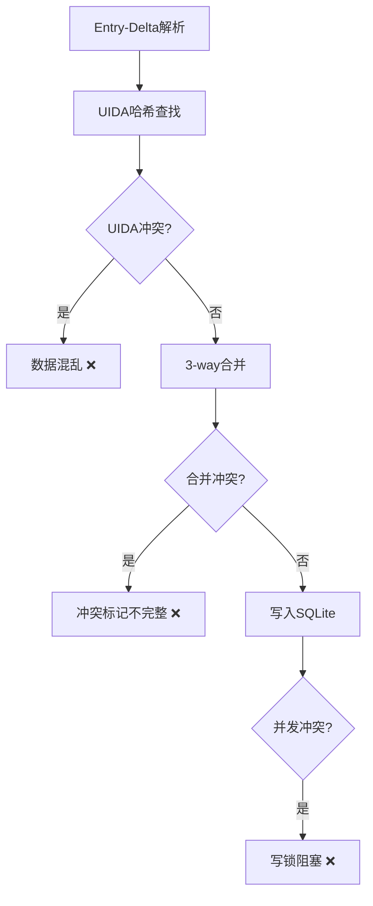
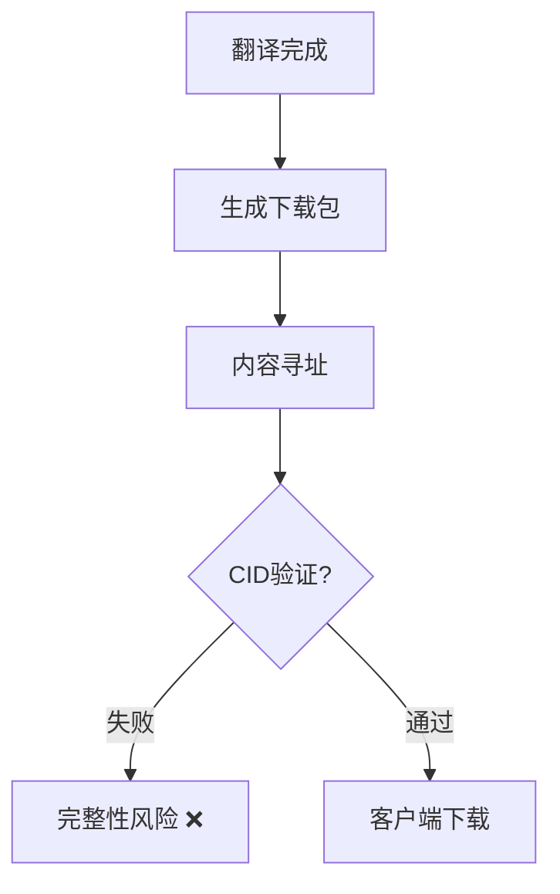

# TH-Suite V6数据库设计审查报告

> **审查时间**: 2025-09-11  
> **审查范围**: /home/saken/project/TH-Suite/apps/mc_l10n 数据上传-翻译-下载流程  
> **关键发现**: 发现多个严重的数据一致性和同步问题

---

## 🚨 关键风险评估

### 🔴 严重风险 (P0) - 需要立即修复

#### 1. **UIDA哈希数据一致性风险**

**问题**: V6设计中UIDA哈希管理存在严重缺陷

```python
# 问题代码位置: sync_service.py:72-85
if cid.startswith("blake3:"):
    uida_hash = cid[7:]  # 移除blake3:前缀
    entries = await self.translation_repo.find_by_uida_hash(uida_hash)
```

**风险分析**:
- CID格式为 `blake3:hash_value`，直接截取作为UIDA哈希
- 缺乏UIDA与CID之间的映射验证
- 不同内容可能产生相同的UIDA哈希，导致数据混乱

**影响**: 
- ❌ 数据完整性破坏
- ❌ 翻译条目错误关联
- ❌ 同步过程中数据丢失

#### 2. **内存会话存储的数据丢失风险**

**问题**: 同步会话和分片数据全部存储在内存中

```python
# 问题代码位置: sync_endpoints.py:36-37
active_sessions: Dict[str, SyncSession] = {}
session_chunks: Dict[str, Dict[str, List[bytes]]] = {}
```

**风险分析**:
- 服务器重启导致所有进行中的同步会话丢失
- 内存泄漏风险，大量分片数据占用内存
- 无持久化机制，无法恢复中断的传输

**影响**:
- ❌ 客户端需要重新上传所有数据
- ❌ 系统稳定性问题
- ❌ 无法支持横向扩展

#### 3. **分片重组后的数据验证缺失**

**问题**: 分片上传完成后缺乏完整数据的验证

```python
# 问题代码位置: sync_endpoints.py:375-377
chunks = session_chunk_data[cid]
full_data = b''.join(chunks)  # 直接重组，无验证
```

**风险分析**:
- 分片传输过程中可能出现数据损坏
- 重组后的数据与原始CID不匹配的风险
- 缺乏端到端的完整性校验

**影响**:
- ❌ 数据损坏可能传播到数据库
- ❌ 翻译质量受损
- ❌ 难以定位数据问题根源

### 🟡 高风险 (P1) - 需要优先处理

#### 4. **3-way合并冲突处理不完善**

**问题**: 合并冲突标记机制存在缺陷

```python
# 问题代码位置: entry_delta.py:256-279
conflict_entry.qa_flags["merge_conflict"] = {
    "local_dst_text": local.dst_text if local else None,
    "remote_dst_text": remote.dst_text if remote else None,
    # 缺少base版本信息
}
```

**风险分析**:
- 冲突解决依赖不完整的上下文信息
- 缺少base版本，无法进行真正的3-way合并
- 冲突标记后的自动解决机制不明确

#### 5. **Bloom过滤器假阳性处理**

**问题**: 缺乏假阳性的处理机制

```python
# 问题代码位置: sync_endpoints.py:122-128
def find_missing_cids(client_bloom: BloomFilter, server_cids: List[str]) -> List[str]:
    missing = []
    for cid in server_cids:
        if not client_bloom.might_contain(cid):  # 可能假阳性
            missing.append(cid)
    return missing
```

**风险分析**:
- Bloom过滤器假阳性导致不必要的数据传输
- 无机制处理客户端实际已有但被误判为缺失的CID
- 网络和存储资源浪费

#### 6. **SQLite并发访问限制**

**问题**: SQLite无法支持高并发的翻译操作

**风险分析**:
- 写锁冲突导致同步操作阻塞
- 多客户端同时同步时性能急剧下降
- 无法支持企业级使用场景

---

## 📊 数据流分析

### 上传阶段问题



### 翻译阶段问题



### 下载阶段风险



---

## 🛠️ 修复建议

### 立即修复 (P0)

1. **UIDA哈希管理重构**
   ```python
   # 建议实现
   class UidaManager:
       def generate_consistent_mapping(self, content: bytes) -> Tuple[str, str]:
           cid = compute_cid(content, HashAlgorithm.BLAKE3)
           uida = self.compute_uida_from_structured_data(content)
           return str(cid), uida.hash_hex
       
       def validate_cid_uida_mapping(self, cid: str, uida_hash: str) -> bool:
           # 验证CID和UIDA的一致性
           pass
   ```

2. **会话持久化**
   ```python
   # 使用数据库存储会话状态
   class PersistentSyncSession:
       def store_session_state(self, session: SyncSession):
           # 存储到数据库
       def restore_session_state(self, session_id: str) -> SyncSession:
           # 从数据库恢复
   ```

3. **端到端数据验证**
   ```python
   # 分片重组后验证
   def validate_reconstructed_data(self, chunks: List[bytes], expected_cid: str) -> bool:
       full_data = b''.join(chunks)
       actual_cid = compute_cid(full_data, HashAlgorithm.BLAKE3)
       return str(actual_cid) == expected_cid
   ```

### 优先处理 (P1)

4. **完善3-way合并**
   ```python
   class Enhanced3WayMerge:
       def merge_with_complete_context(self, base, local, remote) -> MergeResult:
           # 包含完整的base、local、remote信息
           # 提供详细的冲突分析
           # 支持智能冲突解决建议
   ```

5. **Bloom过滤器优化**
   ```python
   class SmartBloomFilter:
       def handle_false_positives(self, client_reported: Set[str], server_actual: Set[str]):
           # 处理假阳性情况
           # 提供验证机制
   ```

6. **数据库并发优化**
   - 考虑迁移到PostgreSQL
   - 实现连接池
   - 添加写操作队列

---

## 📈 性能影响分析

### 当前性能瓶颈

1. **内存使用**
   - 大文件分片占用过多内存
   - 无内存回收机制
   - 可能导致OOM

2. **数据库性能**
   - SQLite写锁限制
   - 频繁的UIDA查询
   - 缺乏查询优化

3. **网络传输**
   - Bloom假阳性导致冗余传输
   - 分片大小固定，未根据网络状况调整

### 性能改进建议

```python
# 建议的性能优化配置
PERFORMANCE_CONFIG = {
    "chunk_size": "adaptive",  # 根据网络状况自适应
    "memory_limit": "512MB",   # 内存使用限制
    "bloom_fpr": 0.001,        # 降低假阳性率
    "db_pool_size": 10,        # 数据库连接池
    "cache_ttl": 3600          # 缓存生存时间
}
```

---

## 🎯 总结与建议

### 风险等级分布
- 🔴 P0严重风险: 3个
- 🟡 P1高风险: 3个
- 🟢 P2中风险: 未列出(架构层面问题)

### 核心建议
1. **立即停用当前V6设计的生产环境部署**
2. **重构UIDA哈希管理机制**
3. **实现完整的数据持久化方案**
4. **建立端到端的数据验证体系**

### 长期架构建议
1. 考虑采用更成熟的分布式存储方案
2. 引入消息队列处理异步任务
3. 实现完整的监控和告警系统
4. 建立自动化的数据完整性检查

**结论**: V6设计存在多个严重的数据安全风险，不建议在当前状态下用于生产环境。建议优先修复P0问题后，进行充分的集成测试验证。