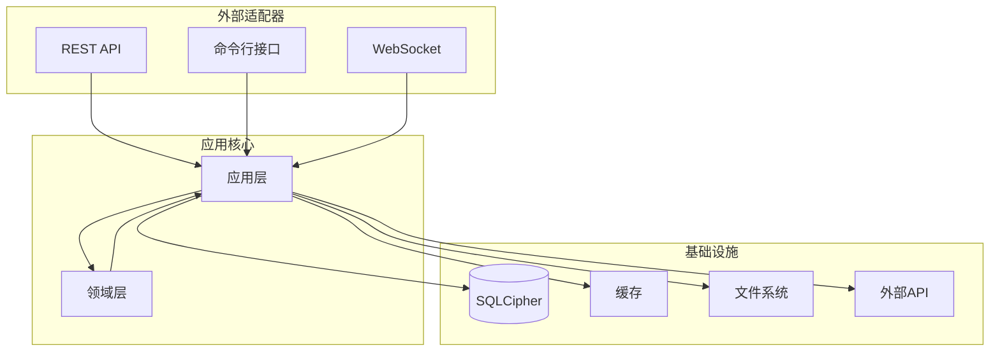

# MC L10n Backend v7.0

[](https://www.python.org/downloads/)
[](https://fastapi.tiangolo.com/)
[](#architecture)
[](#testing)

## 📖 概述

MC L10n (Minecraft Localization) 后端是 TransHub Suite 的核心组件，专门为 Minecraft MOD 和整合包提供专业级本地化管理服务。

### ✨ 核心特性

- **🏗️ 现代架构**: 六边形架构 + 领域驱动设计 (DDD)
- **⚡ 高性能**: 异步处理、智能缓存、批量操作
- **🔒 安全可靠**: SQLCipher 加密、输入验证、错误处理
- **🔄 实时更新**: WebSocket 推送、事件驱动架构
- **🧪 高质量**: 完整的测试覆盖、类型安全
- **🔌 可扩展**: 插件系统、依赖注入、微服务就绪

## 🏗️ 技术架构

### 六边形架构分层



### 技术栈

| 层级 | 技术选择 | 版本 | 用途 |
|------|----------|------|------|
| **Web 框架** | FastAPI | 0.115+ | 高性能异步API |
| **类型验证** | Pydantic | 2.5+ | 数据验证和序列化 |
| **数据库** | SQLCipher | - | 加密SQLite数据库 |
| **日志系统** | Structlog | 25.4+ | 结构化日志记录 |
| **HTTP客户端** | httpx + aiohttp | 最新 | 异步网络请求 |
| **测试框架** | Pytest | 8.4+ | 单元和集成测试 |
| **代码质量** | Ruff + MyPy | 最新 | 检查和类型检查 |

## 🚀 快速开始

### 📋 环境要求

- **Python**: 3.12 或更高版本
- **Poetry**: 1.6 或更高版本 (推荐使用)
- **SQLite**: 3.35 或更高版本
- **系统**: Linux/Windows/macOS

### 安装步骤

```bash
# 1. 安装依赖
poetry install

# 2. 初始化数据库
poetry run python -c "from container import get_container; c = get_container(); c.initialize()"

# 3. 启动服务
poetry run python main.py
```

服务将在 http://localhost:18000 启动

### 快速使用示例

```python
from facade.mc_l10n_facade import MCL10nFacade
from container import get_container

# 初始化
container = get_container()
facade = MCL10nFacade(container)

# 扫描MOD
result = facade.scan_mods(
    path="/path/to/mods",
    recursive=True,
    auto_extract=True
)

print(f"找到 {result.mods_found} 个MOD")
print(f"发现 {result.translations_found} 个翻译条目")
```

## 📁 项目结构

```
src/
├── domain/                 # 领域层
│   ├── models/            # 领域模型（Mod, TranslationProject）
│   ├── value_objects.py   # 值对象（FilePath, ContentHash等）
│   ├── services/          # 领域服务
│   ├── events.py          # 领域事件
│   └── repositories.py    # 仓储接口
│
├── application/           # 应用层
│   ├── services/         # 应用服务（ScanService等）
│   ├── commands.py       # 命令对象
│   └── dto.py           # 数据传输对象
│
├── infrastructure/        # 基础设施层
│   ├── minecraft/        # MC特定实现
│   ├── db/              # 数据库实现
│   │   └── connection_pool.py  # 连接池
│   ├── cache/           # 缓存实现
│   ├── batch_processor.py      # 批处理器
│   ├── request_batcher.py      # 请求批处理
│   ├── event_bus.py            # 事件总线
│   └── unit_of_work.py         # 工作单元
│
├── adapters/             # 适配器层
│   ├── api/             # REST API
│   │   ├── routes/      # API路由
│   │   └── dependencies.py
│   └── cli/             # 命令行接口
│
├── facade/               # 门面层
│   └── mc_l10n_facade.py # 统一接口
│
├── container.py          # 依赖注入容器
└── main.py              # 应用入口
```

## 🔧 配置

### 环境变量 (.env)

```bash
# 数据库
DATABASE_PATH=./data/mc_l10n.db
DATABASE_ENCRYPTION_KEY=your-key-here

# 服务器
SERVER_HOST=0.0.0.0
SERVER_PORT=18000
WORKER_COUNT=4

# 性能
SCAN_BATCH_SIZE=100
SCAN_MAX_WORKERS=4
CACHE_TTL=300

# 日志
LOG_LEVEL=INFO
LOG_FILE=./logs/mc_l10n.log
```

## 🎯 核心功能

### 1. MOD扫描
- 自动识别MOD文件（JAR/ZIP）
- 提取语言文件
- 增量扫描支持
- 批处理优化

### 2. 翻译管理
- 多语言支持
- 翻译版本控制
- 质量评分系统
- 冲突解决机制

### 3. 项目管理
- 创建翻译项目
- 任务分配
- 进度跟踪
- 自动化工作流

### 4. 质量保证
- 自动质量检查
- 术语一致性验证
- 批准工作流
- 质量报告

### 5. 同步服务
- Trans-Hub平台集成
- 导入/导出功能
- 冲突自动解决
- 实时同步

## 🚄 性能优化

### 批处理器 (BatchProcessor)
```python
processor = BatchProcessor(batch_size=100, max_workers=4)
result = processor.process(items, process_func)
```

### 连接池 (ConnectionPool)
```python
pool = ConnectionPool(max_connections=10)
with pool.get_connection() as conn:
    # 使用连接
```

### 缓存装饰器
```python
@cache(ttl=300)  # 5分钟缓存
def expensive_operation():
    pass
```

### 请求批处理
```python
batcher = RequestBatcher()
result = await batcher.submit('batch_key', params)
```

## 📊 API 文档

### 主要端点

| 端点 | 方法 | 描述 |
|------|------|------|
| `/api/v1/scan` | POST | 扫描MOD目录 |
| `/api/v1/mods` | GET | 获取MOD列表 |
| `/api/v1/translations` | POST | 提交翻译 |
| `/api/v1/projects` | POST | 创建项目 |
| `/api/v1/quality/check` | POST | 质量检查 |
| `/api/v1/sync/transhub` | POST | 同步到Trans-Hub |

完整API文档: http://localhost:18000/docs

## 🧪 测试

```bash
# 运行所有测试
poetry run pytest

# 运行特定测试
poetry run pytest tests/test_domain_models.py

# 带覆盖率
poetry run pytest --cov=src

# 性能测试
poetry run pytest -m benchmark
```

## 📝 开发指南

### 添加新的领域模型

```python
# src/domain/models/your_model.py
from dataclasses import dataclass
from domain.base import AggregateRoot

@dataclass
class YourModel(AggregateRoot):
    # 实现你的模型
    pass
```

### 创建应用服务

```python
# src/application/services/your_service.py
class YourService:
    def __init__(self, repository):
        self.repository = repository
    
    def execute_use_case(self, command):
        # 实现用例
        pass
```

### 注册到容器

```python
# src/container.py
def _init_services(self):
    self.services['your_service'] = YourService(
        self.repositories['your_repo']
    )
```

## 🔍 故障排除

### 数据库锁定
```python
# 使用连接池避免锁定
pool = get_connection_pool()
```

### 内存问题
```python
# 减小批处理大小
processor = BatchProcessor(batch_size=20)
```

### 性能问题
```python
# 启用缓存
@cache_5min
def slow_operation():
    pass
```

## 📚 相关文档

- [API文档](../../../docs/projects/mc-l10n/API_DOCUMENTATION.md)
- [使用指南](../../../docs/projects/mc-l10n/USER_GUIDE.md)
- [数据库设计](../../../docs/projects/mc-l10n/DATABASE_SETUP.md)
- [架构设计](../../../docs/projects/mc-l10n/architecture/)

## 🤝 贡献

欢迎贡献代码！请遵循以下步骤：

1. Fork 项目
2. 创建特性分支 (`git checkout -b feature/AmazingFeature`)
3. 提交更改 (`git commit -m 'Add some AmazingFeature'`)
4. 推送到分支 (`git push origin feature/AmazingFeature`)
5. 开启 Pull Request

## 📄 许可证

本项目采用 MIT 许可证 - 查看 [LICENSE](LICENSE) 文件了解详情

## 🙏 致谢

- FastAPI - 高性能Web框架
- SQLite - 轻量级数据库
- Poetry - Python依赖管理
- Trans-Hub - 翻译平台集成

---

**版本**: 6.0.0  
**最后更新**: 2025-09-07  
**维护者**: TH-Suite Development Team