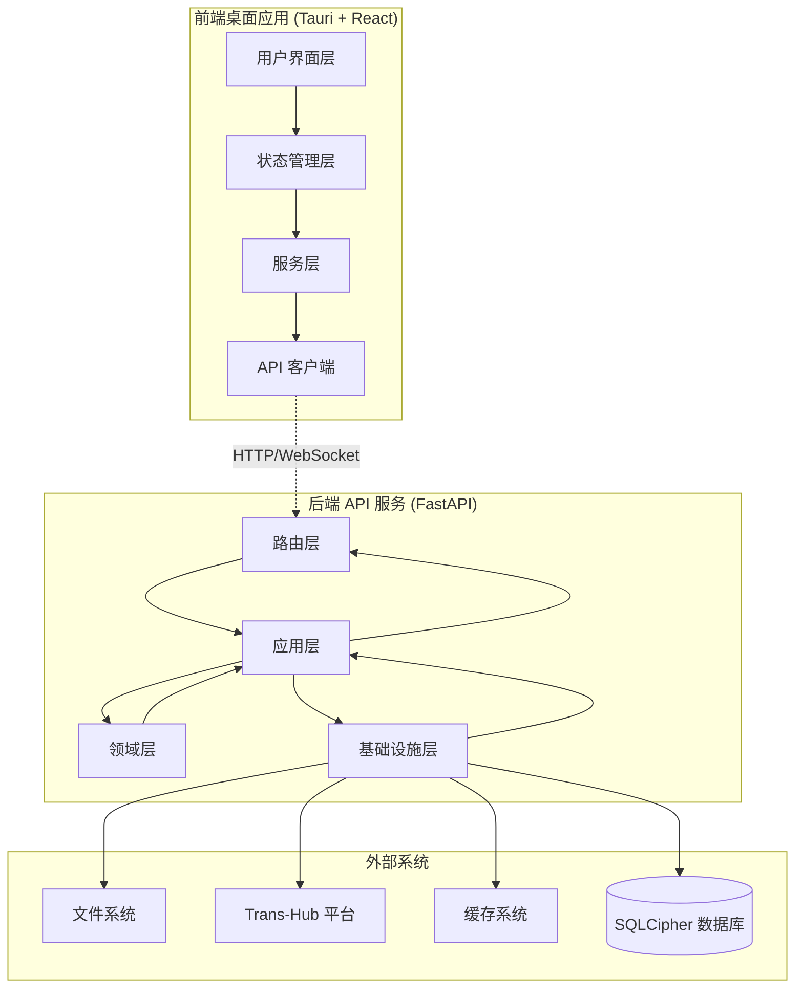
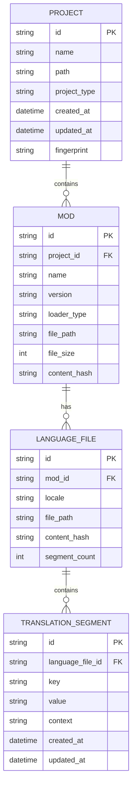
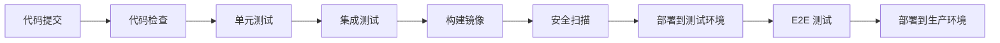
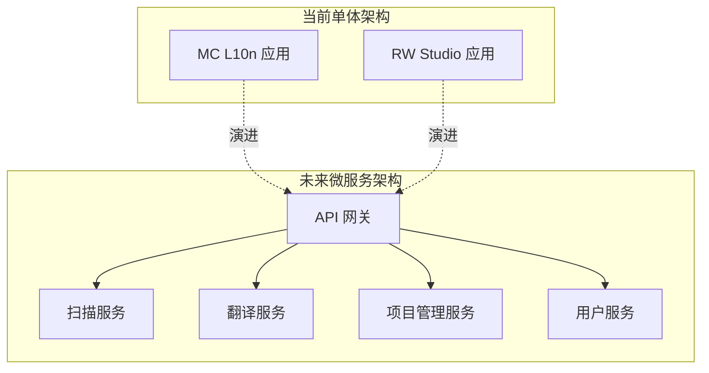

# TH-Suite 架构设计文档

## 🏗️ 整体架构概览

TransHub Suite 采用现代化的六边形架构（Hexagonal Architecture）结合领域驱动设计（DDD）的方式，实现了高度模块化和可测试的系统设计。



## 🐍 后端架构详解

### 六边形架构分层

#### 1. 领域层 (Domain Layer)
**核心业务逻辑，不依赖任何外部技术**

```
src/domain/
├── models/                 # 领域模型和聚合根
│   ├── mod.py             # Mod 聚合根
│   ├── translation_project.py  # 翻译项目聚合
│   └── translation.py      # 翻译实体
├── value_objects.py        # 值对象定义
├── events.py              # 领域事件
├── services/              # 领域服务
│   ├── translation_service.py
│   └── conflict_resolution_service.py
└── repositories.py        # 仓储接口（端口）
```

**核心概念：**

- **聚合根 (Aggregate Root)**: `Mod`, `TranslationProject`
- **值对象 (Value Objects)**: `ModId`, `ContentHash`, `TranslationKey`, `LanguageCode`
- **领域事件 (Domain Events)**: `ModScannedEvent`, `TranslationUpdatedEvent`
- **领域服务 (Domain Services)**: 复杂业务逻辑的封装

#### 2. 应用层 (Application Layer)
**业务用例编排，协调领域对象完成业务操作**

```
src/application/
├── services/              # 应用服务（用例）
│   ├── scan_application_service.py
│   └── translation_application_service.py
├── commands/              # 命令对象 (CQRS)
│   ├── scan_commands.py
│   └── translation_commands.py
├── queries/               # 查询对象 (CQRS)
│   └── project_queries.py
├── dto.py                 # 数据传输对象
└── events/               # 应用事件处理器
    └── event_handlers.py
```

**设计原则：**

- **CQRS 模式**: 分离命令和查询操作
- **应用服务**: 协调领域对象，不包含业务规则
- **DTO 模式**: 数据传输边界清晰

#### 3. 适配器层 (Adapters Layer)
**外部接口实现，连接外部世界和应用核心**

```
src/adapters/
├── api/                   # REST API 适配器
│   ├── routes/
│   │   ├── scan_routes.py
│   │   ├── mod_routes.py
│   │   └── facade_routes.py
│   ├── dependencies.py    # 依赖注入
│   └── middleware.py      # 中间件
└── cli/                   # 命令行接口适配器
    └── commands.py
```

#### 4. 基础设施层 (Infrastructure Layer)
**技术实现细节，提供技术服务**

```
src/infrastructure/
├── persistence/           # 数据持久化
│   ├── sqlite_repositories.py  # Repository 实现
│   └── unit_of_work.py         # 工作单元模式
├── parsers/              # 文件解析器
│   ├── minecraft_parser.py
│   └── language_file_parser.py
├── scanners/             # 文件扫描器
│   └── mod_scanner.py
├── event_bus.py          # 事件总线
├── cache/               # 缓存实现
│   └── memory_cache.py
└── external/            # 外部系统集成
    └── trans_hub_client.py
```

### 依赖注入系统

```python
# container.py - 服务容器
class ServiceContainer:
    def __init__(self):
        self._repositories = {}
        self._services = {}
        self._singletons = {}
    
    def register_singleton(self, interface, implementation):
        """注册单例服务"""
        
    def register_transient(self, interface, implementation):
        """注册瞬态服务"""
        
    def get(self, interface):
        """获取服务实例"""
```

### 事件驱动架构

```python
# 领域事件定义
@dataclass
class ModScannedEvent:
    mod_id: ModId
    file_count: int
    language_count: int
    timestamp: datetime

# 事件处理器
class ModScannedEventHandler:
    async def handle(self, event: ModScannedEvent):
        # 更新缓存、发送通知等
        pass

# 事件总线
class EventBus:
    async def publish(self, event: DomainEvent):
        """发布事件到所有订阅者"""
        
    def subscribe(self, event_type, handler):
        """订阅特定类型的事件"""
```

## ⚛️ 前端架构详解

### 组件层次结构

```
src/
├── components/            # 可复用组件
│   ├── common/           # 通用组件
│   │   ├── Button/
│   │   ├── Modal/
│   │   └── Loading/
│   ├── business/         # 业务组件
│   │   ├── ModCard/
│   │   ├── ScanProgress/
│   │   └── TranslationEditor/
│   └── layout/           # 布局组件
│       ├── Header/
│       ├── Sidebar/
│       └── MainContent/
├── pages/                # 页面组件
│   ├── ScanPageMinecraft.tsx
│   ├── ProjectPageMinecraft.tsx
│   └── TransferPage.tsx
├── hooks/                # 自定义 Hooks
│   ├── useApi.ts
│   ├── useProgress.ts
│   └── useToast.ts
├── services/             # 业务逻辑服务
│   ├── domain/          # 领域服务
│   │   ├── scanService.ts
│   │   └── projectService.ts
│   ├── infrastructure/   # 基础设施服务
│   │   ├── apiClient.ts
│   │   └── storageService.ts
│   └── container/        # 服务容器
│       └── serviceContainer.ts
└── stores/               # 状态管理
    ├── appStore.ts
    ├── scanStore.ts
    └── projectStore.ts
```

### 服务容器模式

```typescript
// 前端服务容器
class ServiceContainer {
  private services = new Map<string, any>();
  
  register<T>(name: string, factory: () => T): void {
    this.services.set(name, factory);
  }
  
  get<T>(name: string): T {
    const factory = this.services.get(name);
    if (!factory) throw new Error(`Service ${name} not found`);
    return factory();
  }
}

// 服务注册
container.register('scanService', () => new ScanService(
  container.get('apiClient')
));

container.register('projectService', () => new ProjectService(
  container.get('apiClient'),
  container.get('storageService')
));
```

### 状态管理架构

```typescript
// Zustand 存储设计
interface AppStore {
  // 应用状态
  isLoading: boolean;
  currentProject: Project | null;
  
  // 操作
  setLoading: (loading: boolean) => void;
  setCurrentProject: (project: Project) => void;
  
  // 异步操作
  loadProject: (id: string) => Promise<void>;
}

// React Query 集成
const useScanProgress = (taskId: string) => {
  return useQuery({
    queryKey: ['scan', 'progress', taskId],
    queryFn: () => scanService.getProgress(taskId),
    refetchInterval: 1000, // 实时轮询
  });
};
```

## 🔄 实时通信架构

### WebSocket + 轮询混合模式

```typescript
class ProgressService {
  private webSocket: WebSocket | null = null;
  private pollingInterval: number | null = null;
  
  // 启动混合模式进度监控
  startProgressTracking(taskId: string): Observable<ProgressUpdate> {
    return merge(
      this.createWebSocketStream(taskId),
      this.createPollingStream(taskId)
    ).pipe(
      distinctUntilChanged(),
      shareReplay(1)
    );
  }
  
  private createWebSocketStream(taskId: string): Observable<ProgressUpdate> {
    // WebSocket 实现
  }
  
  private createPollingStream(taskId: string): Observable<ProgressUpdate> {
    // 轮询实现，WebSocket 失败时的备选方案
  }
}
```

### 后端实时推送

```python
class ProgressWebSocketHandler:
    async def connect(self, websocket: WebSocket, task_id: str):
        await websocket.accept()
        
        # 订阅进度更新事件
        async def on_progress_update(event: ProgressUpdateEvent):
            if event.task_id == task_id:
                await websocket.send_json({
                    "type": "progress",
                    "data": event.to_dict()
                })
        
        event_bus.subscribe(ProgressUpdateEvent, on_progress_update)
```

## 🗄️ 数据架构

### 数据模型设计



### 仓储模式实现

```python
class ModRepository(ABC):
    """Mod 聚合根仓储接口"""
    
    @abstractmethod
    async def get_by_id(self, mod_id: ModId) -> Optional[Mod]:
        pass
    
    @abstractmethod
    async def save(self, mod: Mod) -> None:
        pass
    
    @abstractmethod  
    async def find_by_project(self, project_id: str) -> List[Mod]:
        pass

class SQLiteModRepository(ModRepository):
    """SQLite 实现"""
    
    async def get_by_id(self, mod_id: ModId) -> Optional[Mod]:
        # SQLite 查询实现
        pass
        
    async def save(self, mod: Mod) -> None:
        # SQLite 保存实现
        pass
```

## 🔧 插件和扩展架构

### 解析器插件系统

```python
class ParserPlugin(ABC):
    """解析器插件基类"""
    
    @property
    @abstractmethod
    def name(self) -> str:
        pass
    
    @property
    @abstractmethod
    def supported_extensions(self) -> List[str]:
        pass
    
    @abstractmethod
    def parse(self, file_path: Path) -> List[TranslationSegment]:
        pass

class ParserRegistry:
    """解析器注册表"""
    
    def register(self, parser: ParserPlugin):
        self.parsers[parser.name] = parser
    
    def get_parser(self, file_extension: str) -> Optional[ParserPlugin]:
        # 根据文件扩展名返回合适的解析器
        pass
```

### 翻译引擎插件

```python
class TranslationEngine(ABC):
    """翻译引擎接口"""
    
    @abstractmethod
    async def translate(
        self, 
        text: str, 
        source_lang: str, 
        target_lang: str
    ) -> TranslationResult:
        pass

class TransHubEngine(TranslationEngine):
    """Trans-Hub 翻译引擎实现"""
    
    async def translate(self, text: str, source_lang: str, target_lang: str):
        # 调用 Trans-Hub API
        pass
```

## 🔒 安全架构

### 数据加密

```python
class EncryptedDatabase:
    """加密数据库适配器"""
    
    def __init__(self, db_path: str, encryption_key: str):
        self.connection = sqlite3.connect(
            f"file:{db_path}?key={encryption_key}",
            uri=True
        )
        
    async def execute(self, query: str, params=None):
        # 加密数据库操作
        pass
```

### API 安全

```python
class APIKeyMiddleware:
    """API 密钥验证中间件"""
    
    async def __call__(self, request: Request, call_next):
        api_key = request.headers.get("X-API-Key")
        if not self.validate_api_key(api_key):
            raise HTTPException(401, "Invalid API key")
        
        response = await call_next(request)
        return response
```

## 📊 可观测性架构

### 结构化日志

```python
import structlog

logger = structlog.get_logger()

# 结构化日志记录
await logger.ainfo(
    "Mod scan completed",
    mod_id=mod.id,
    file_count=len(mod.language_files),
    duration=scan_duration,
    tags=["scan", "success"]
)
```

### 性能监控

```python
class PerformanceMiddleware:
    """性能监控中间件"""
    
    async def __call__(self, request: Request, call_next):
        start_time = time.time()
        
        response = await call_next(request)
        
        duration = time.time() - start_time
        
        # 记录请求性能指标
        logger.info(
            "Request completed",
            method=request.method,
            path=request.url.path,
            duration=duration,
            status_code=response.status_code
        )
        
        return response
```

### 健康检查

```python
@router.get("/health")
async def health_check():
    """系统健康检查"""
    
    checks = {
        "database": await check_database_connection(),
        "trans_hub": await check_trans_hub_connection(),
        "disk_space": check_disk_space(),
        "memory": check_memory_usage()
    }
    
    status = "healthy" if all(checks.values()) else "unhealthy"
    
    return {
        "status": status,
        "checks": checks,
        "timestamp": datetime.now().isoformat()
    }
```

## 🚀 部署架构

### 开发环境

```yaml
# docker-compose.dev.yml
version: '3.8'
services:
  backend:
    build: 
      context: .
      dockerfile: apps/mc_l10n/backend/Dockerfile.dev
    volumes:
      - ./apps/mc_l10n/backend:/app
    ports:
      - "18000:8000"
    environment:
      - DEBUG=true
      - DATABASE_URL=sqlite:///data/dev.db
    
  frontend:
    build:
      context: apps/mc_l10n/frontend
      dockerfile: Dockerfile.dev
    volumes:
      - ./apps/mc_l10n/frontend/src:/app/src
    ports:
      - "18001:3000"
```

### 生产环境

```yaml
# docker-compose.prod.yml  
version: '3.8'
services:
  backend:
    image: th-suite/mc-l10n-backend:latest
    ports:
      - "18000:8000"
    environment:
      - DEBUG=false
      - DATABASE_URL=sqlite:///data/production.db
      - LOG_LEVEL=INFO
    volumes:
      - ./data:/app/data
    restart: unless-stopped
    
  nginx:
    image: nginx:alpine
    ports:
      - "80:80"
      - "443:443"
    volumes:
      - ./nginx.conf:/etc/nginx/nginx.conf
      - ./ssl:/etc/ssl
    depends_on:
      - backend
```

## 🔄 CI/CD 架构

### 构建流水线



### 质量门禁

```yaml
# .github/workflows/ci.yml
name: CI/CD Pipeline

on:
  push:
    branches: [main, develop]
  pull_request:
    branches: [main]

jobs:
  quality-checks:
    runs-on: ubuntu-latest
    steps:
      - uses: actions/checkout@v3
      
      - name: Python Quality Checks
        run: |
          poetry install
          poetry run ruff check .
          poetry run mypy apps packages
          poetry run pytest --cov=80
          
      - name: Frontend Quality Checks  
        run: |
          pnpm install
          pnpm run lint
          pnpm run type-check
          pnpm run test
```

## 📈 扩展性设计

### 微服务演进路径



### 性能扩展策略

1. **水平扩展**: 多实例负载均衡
2. **缓存层**: Redis 分布式缓存
3. **数据库分离**: 读写分离、分片
4. **CDN**: 静态资源加速
5. **消息队列**: 异步任务处理

## 🔮 技术演进规划

### 短期目标 (3-6 个月)
- [ ] 完善测试覆盖率到 90%
- [ ] 实现完整的 CI/CD 流水线
- [ ] 添加性能监控仪表板
- [ ] 优化数据库查询性能

### 中期目标 (6-12 个月)  
- [ ] 微服务架构重构
- [ ] 支持分布式部署
- [ ] 插件市场开发
- [ ] 移动端适配

### 长期目标 (12+ 个月)
- [ ] 云原生架构转型
- [ ] AI 翻译集成
- [ ] 多租户支持
- [ ] 国际化部署

---

本架构文档描述了 TH-Suite 的核心架构设计思想和实现方式。随着系统的演进，本文档将持续更新以反映最新的架构状态。