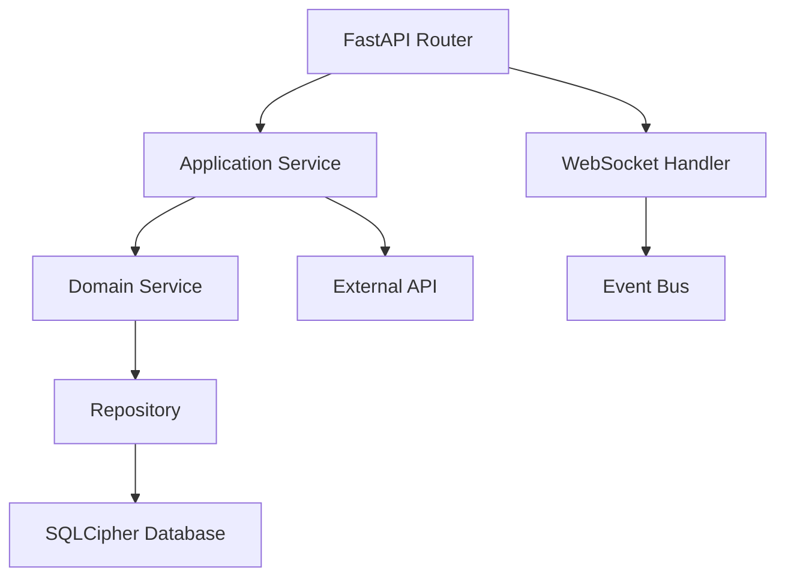
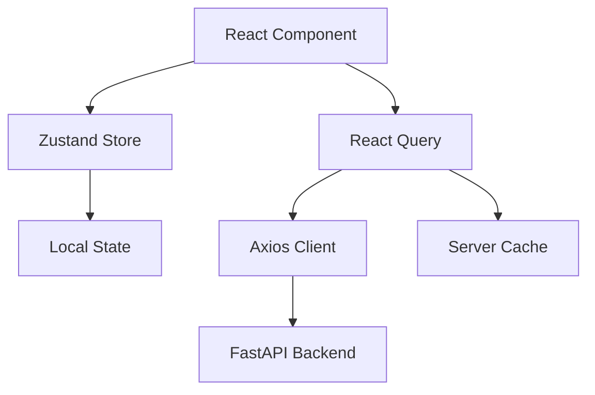

# TH-Suite 技术栈详细文档

## 📋 技术栈总览

TransHub Suite 采用现代化的全栈技术栈，结合了性能、开发体验和可维护性的最佳实践。

### 🏗️ 核心架构

- **架构模式**: 六边形架构 (Hexagonal Architecture) + DDD (领域驱动设计)
- **项目类型**: Monorepo (单一仓库管理多应用)
- **构建策略**: 增量构建 + 缓存优化
- **部署方式**: 桌面应用 (Tauri) + 可选容器化部署

## 🐍 Python 后端技术栈

### 核心框架

| 技术 | 版本 | 用途 | 特点 |
|------|------|------|------|
| **FastAPI** | ^0.115.0 | Web 框架 | 高性能、自动文档生成、类型安全 |
| **Uvicorn** | ^0.35.0 | ASGI 服务器 | 支持 WebSocket、高并发 |
| **Pydantic** | ^2.5.0 | 数据验证 | 基于类型注解的验证和序列化 |
| **Pydantic Settings** | ^2.1.0 | 配置管理 | 环境变量和配置文件管理 |

### 异步和网络通信

| 技术 | 版本 | 用途 | 选择原因 |
|------|------|------|----------|
| **aiofiles** | ^24.1.0 | 异步文件操作 | 非阻塞文件 I/O |
| **aiohttp** | ^3.12.15 | 异步 HTTP 客户端 | 内置连接池、会话管理 |
| **httpx** | ^0.28.1 | 现代 HTTP 客户端 | 同步/异步支持、HTTP/2 |
| **websockets** | ^15.0 | WebSocket 支持 | 实时进度推送 |
| **python-multipart** | ^0.0.20 | 文件上传 | 多部分表单数据处理 |

### 数据处理和解析

| 技术 | 版本 | 用途 | 支持格式 |
|------|------|------|----------|
| **toml** | ^0.10.2 | TOML 解析 | 配置文件、Mod 元数据 |
| **pyyaml** | ^6.0.1 | YAML 处理 | 配置文件、数据交换 |
| **jsonschema** | ^4.20.0 | JSON Schema 验证 | API 数据验证、配置校验 |
| **chardet** | ^5.2.0 | 字符编码检测 | 自动检测文件编码 |

### 系统集成和工具

| 技术 | 版本 | 用途 | 功能 |
|------|------|------|------|
| **structlog** | ^25.4.0 | 结构化日志 | 日志聚合、分析友好 |
| **rich** | ^14.1.0 | 富文本输出 | 美化控制台输出、进度条 |
| **click** | ^8.1.7 | CLI 框架 | 命令行工具构建 |
| **psutil** | ^7.0.0 | 系统监控 | 进程、内存、磁盘监控 |
| **python-dotenv** | ^1.0.0 | 环境变量 | .env 文件加载 |

## 🔧 Python 开发和质量工具

### 测试框架

| 技术 | 版本 | 用途 | 特点 |
|------|------|------|------|
| **pytest** | ^8.4.2 | 测试框架 | 插件丰富、简洁语法 |
| **pytest-asyncio** | ^1.1.0 | 异步测试 | 支持 async/await 测试 |

### 代码质量

| 技术 | 版本 | 用途 | 优势 |
|------|------|------|------|
| **ruff** | ^0.12.11 | 代码检查和格式化 | 速度极快、配置简单 |
| **mypy** | ^1.7.1 | 静态类型检查 | 类型安全、IDE 集成 |
| **black** | ^25.1.0 | 代码格式化 | 统一代码风格 |

### 类型支持

| 技术 | 版本 | 用途 |
|------|------|------|
| **types-toml** | ^0.10.8 | TOML 类型定义 |

## ⚛️ 前端技术栈

### 核心框架

| 技术 | 版本 | 用途 | 特点 |
|------|------|------|------|
| **React** | ^18.3.1 | UI 库 | 组件化、虚拟 DOM、Hooks |
| **TypeScript** | ^5.2.2 | 类型语言 | 静态类型、IDE 支持 |
| **Vite** | ^4.5.0 | 构建工具 | 快速热更新、ES 模块 |

### 桌面应用框架

| 技术 | 版本 | 用途 | 优势 |
|------|------|------|------|
| **Tauri** | ^2.8.0 | 桌面应用框架 | 原生性能、小体积、安全 |
| **@tauri-apps/api** | ^2.8.0 | Tauri API 绑定 | 系统调用、文件访问 |
| **@tauri-apps/plugin-***** | 多个 | Tauri 插件 | 对话框、文件系统、通知等 |

### UI 组件和设计系统

| 技术 | 版本 | 用途 | 特点 |
|------|------|------|------|
| **Material-UI** | ^5.14.18 | React UI 库 | 完整设计系统、主题化 |
| **@mui/icons-material** | ^5.18.0 | 图标库 | Material Design 图标 |
| **@mui/x-data-grid** | ^6.18.1 | 数据表格 | 高性能、功能丰富 |
| **@mui/x-tree-view** | ^6.17.0 | 树形组件 | 层级数据展示 |
| **Radix UI** | 多个组件 | 无头 UI 库 | 可访问性、自定义能力 |
| **Lucide React** | ^0.294.0 | 现代图标库 | 简洁、一致的图标 |

### 样式和动画

| 技术 | 版本 | 用途 | 优势 |
|------|------|------|------|
| **TailwindCSS** | ^4.1.12 | CSS 框架 | 实用优先、响应式 |
| **@emotion/react** | ^11.14.0 | CSS-in-JS | 动态样式、主题支持 |
| **@emotion/styled** | ^11.14.0 | 样式组件 | 组件级样式 |
| **Framer Motion** | ^10.16.5 | 动画库 | 流畅动画、手势支持 |

## 🔄 状态管理和数据流

### 客户端状态

| 技术 | 版本 | 用途 | 特点 |
|------|------|------|------|
| **Zustand** | ^4.4.7 | 状态管理 | 轻量、简洁 API |
| **Immer** | ^10.1.3 | 不可变更新 | 简化状态更新逻辑 |

### 服务器状态

| 技术 | 版本 | 用途 | 功能 |
|------|------|------|------|
| **@tanstack/react-query** | ^5.8.4 | 服务器状态管理 | 缓存、同步、后台更新 |
| **Axios** | ^1.6.2 | HTTP 客户端 | 请求拦截、错误处理 |

## 📝 表单和验证

| 技术 | 版本 | 用途 | 优势 |
|------|------|------|------|
| **React Hook Form** | ^7.48.2 | 表单管理 | 性能优异、验证集成 |
| **@hookform/resolvers** | ^3.3.2 | 验证解析器 | 多种验证库支持 |
| **Zod** | ^3.22.4 | Schema 验证 | TypeScript 优先 |

## 🌐 路由和国际化

### 路由管理

| 技术 | 版本 | 用途 | 特点 |
|------|------|------|------|
| **React Router DOM** | ^6.20.1 | 客户端路由 | 声明式路由、懒加载 |

### 国际化

| 技术 | 版本 | 用途 | 功能 |
|------|------|------|------|
| **i18next** | ^23.7.6 | 国际化核心 | 多语言支持、插值 |
| **react-i18next** | ^13.5.0 | React 集成 | Hooks、组件支持 |
| **i18next-browser-languagedetector** | ^7.2.0 | 语言检测 | 自动检测用户语言 |
| **i18next-http-backend** | ^2.4.2 | 远程加载 | 动态语言包加载 |

## 🔧 开发工具

### 代码质量

| 技术 | 版本 | 用途 | 配置 |
|------|------|------|------|
| **ESLint** | ^8.53.0 | 代码检查 | TypeScript、React 规则 |
| **@typescript-eslint/****** | ^6.10.0 | TS ESLint 插件 | 类型感知检查 |
| **Prettier** | ^3.6.2 | 代码格式化 | 统一代码风格 |

### 构建和打包

| 技术 | 版本 | 用途 | 特性 |
|------|------|------|------|
| **Vite** | ^4.5.0 | 开发服务器 | HMR、ES 模块 |
| **@vitejs/plugin-react** | ^4.1.1 | React 插件 | JSX 转换、Fast Refresh |
| **PostCSS** | ^8.5.6 | CSS 处理 | 插件生态 |
| **Autoprefixer** | ^10.4.21 | CSS 前缀 | 浏览器兼容 |

## 📦 包管理和工作空间

### Python 包管理

| 技术 | 用途 | 配置文件 |
|------|------|----------|
| **Poetry** | 依赖管理、虚拟环境 | `pyproject.toml` |

### Node.js 包管理

| 技术 | 用途 | 配置文件 |
|------|------|----------|
| **pnpm** | 包管理器、工作空间 | `package.json`, `pnpm-workspace.yaml` |

### 任务运行

| 技术 | 用途 | 配置文件 |
|------|------|----------|
| **Task** | 任务自动化 | `Taskfile.yml` |
| **npm scripts** | Node.js 脚本 | `package.json` |

## 🏛️ 架构模式和设计模式

### 后端架构模式

| 模式 | 应用场景 | 实现方式 |
|------|----------|----------|
| **六边形架构** | 业务逻辑隔离 | 端口-适配器模式 |
| **领域驱动设计** | 复杂业务建模 | 聚合、值对象、领域服务 |
| **CQRS** | 读写分离 | 命令和查询分离 |
| **依赖注入** | 控制反转 | IoC 容器 |
| **工作单元模式** | 事务管理 | 聚合事务操作 |
| **仓储模式** | 数据访问抽象 | Repository 接口 |

### 前端架构模式

| 模式 | 应用场景 | 实现技术 |
|------|----------|----------|
| **服务容器** | 依赖管理 | 自定义容器 |
| **观察者模式** | 状态订阅 | Zustand、React Query |
| **组合模式** | 组件组合 | React Hooks |
| **适配器模式** | API 集成 | Axios 封装 |

## 🔄 数据流和通信

### 后端数据流



### 前端数据流



## 📊 性能和优化

### 后端性能优化

| 技术/策略 | 用途 | 实现方式 |
|-----------|------|----------|
| **异步I/O** | 提升并发性能 | asyncio、aiofiles |
| **连接池** | 减少连接开销 | httpx、aiohttp 内置 |
| **数据库优化** | 查询性能 | SQLCipher 索引、批量操作 |
| **缓存策略** | 减少重复计算 | 内存缓存、文件缓存 |
| **批量处理** | 提升吞吐量 | 批量数据库操作 |

### 前端性能优化

| 技术/策略 | 用途 | 实现方式 |
|-----------|------|----------|
| **代码分割** | 减少初始包大小 | React.lazy、动态导入 |
| **缓存管理** | 减少网络请求 | React Query 缓存 |
| **虚拟化** | 处理大数据集 | @mui/x-data-grid |
| **懒加载** | 按需加载 | React Router 懒加载 |
| **状态优化** | 减少重渲染 | Zustand、Immer |

## 🔒 安全性考虑

### 后端安全

| 技术/策略 | 用途 | 实现方式 |
|-----------|------|----------|
| **数据加密** | 敏感数据保护 | SQLCipher AES-256 |
| **输入验证** | 防止注入攻击 | Pydantic 验证 |
| **CORS 配置** | 跨域访问控制 | FastAPI CORS 中间件 |
| **日志安全** | 敏感信息过滤 | Structlog 过滤器 |

### 前端安全

| 技术/策略 | 用途 | 实现方式 |
|-----------|------|----------|
| **CSP 策略** | XSS 防护 | Tauri 安全配置 |
| **输入清理** | 防止 XSS | React 自动转义 |
| **敏感数据** | 避免泄露 | 环境变量、安全存储 |

## 🧪 测试策略

### 后端测试

| 测试类型 | 工具 | 覆盖范围 |
|----------|------|----------|
| **单元测试** | pytest | 领域逻辑、工具函数 |
| **集成测试** | pytest + TestClient | API 端点 |
| **异步测试** | pytest-asyncio | 异步函数 |

### 前端测试

| 测试类型 | 工具 | 覆盖范围 |
|----------|------|----------|
| **组件测试** | 待配置 | React 组件 |
| **端到端测试** | 待配置 | 用户流程 |

## 🔄 持续集成和部署

### 开发工作流

```bash
# 开发环境启动
task dev:mc           # 启动 MC L10n 应用
task dev:rw           # 启动 RW Studio 应用

# 代码质量检查
task lint             # 运行所有检查
task test             # 运行所有测试

# 构建和发布
task build            # 构建所有应用
task build:mc         # 构建 MC L10n
```

### 依赖更新策略

| 依赖类型 | 更新频率 | 策略 |
|----------|----------|------|
| **安全更新** | 立即 | 自动更新 |
| **补丁版本** | 每周 | 自动更新 |
| **次版本** | 每月 | 手动评估 |
| **主版本** | 按需 | 充分测试后更新 |

## 📈 监控和可观测性

### 日志系统

| 技术 | 用途 | 格式 |
|------|------|------|
| **Structlog** | 结构化日志 | JSON |
| **Rich** | 开发日志美化 | 彩色输出 |

### 性能监控

| 指标 | 监控方式 | 工具 |
|------|----------|------|
| **内存使用** | psutil | 系统监控 |
| **请求延迟** | 中间件 | FastAPI |
| **错误率** | 异常捕获 | Python logging |

## 🎯 未来技术规划

### 短期规划 (3-6 months)

- [ ] 添加端到端测试框架
- [ ] 实现性能监控仪表板
- [ ] 优化构建缓存策略
- [ ] 添加自动化部署流水线

### 长期规划 (6-12 months)

- [ ] 微服务架构重构
- [ ] 插件系统扩展
- [ ] 云端部署支持
- [ ] 移动端支持

## 📚 技术决策记录

### 为什么选择 Tauri 而不是 Electron?

- **性能**: Rust 内核，内存占用更少
- **安全性**: 严格的安全模型
- **体积**: 包体积显著更小
- **原生集成**: 更好的系统集成

### 为什么选择 FastAPI 而不是 Django?

- **性能**: 异步支持，高并发性能
- **类型安全**: 基于类型注解的自动验证
- **现代化**: 现代 Python 特性支持
- **文档**: 自动生成 OpenAPI 文档

### 为什么选择 Material-UI?

- **成熟度**: 稳定的组件生态
- **主题化**: 完善的主题系统
- **可访问性**: 内置无障碍支持
- **文档**: 详细的文档和示例

---

本文档会随着技术栈的演进持续更新。如有疑问或建议，请提交 Issue 或 Pull Request。