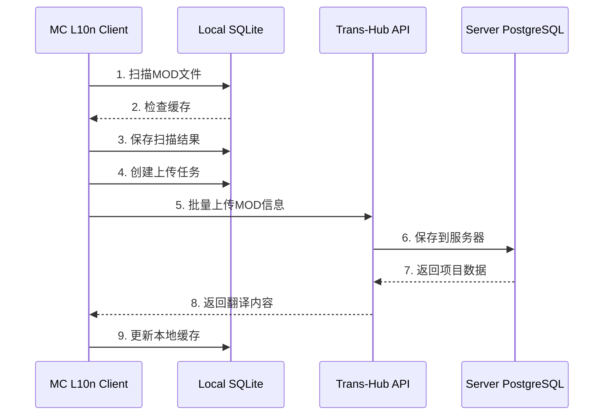
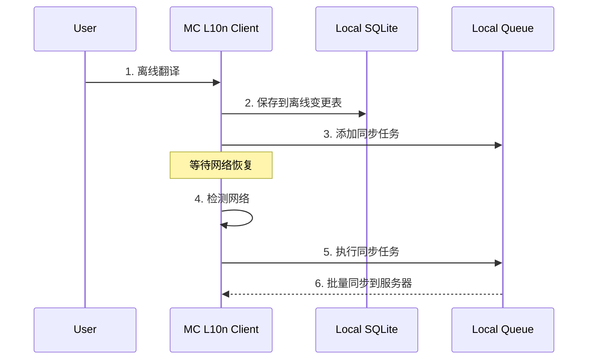

# MC L10n 数据库架构设计 v4.0 - 客户端/服务器分离架构

**版本**: 4.0.0  
**更新日期**: 2025-09-06  
**架构类型**: Client-Server Separation + DDD  

## 📋 架构概述

### 系统分层

```
┌─────────────────────────────────────────────────────────┐
│                   Trans-Hub Server                       │
│              (WSL: ~/project/Trans-Hub)                  │
│  - 翻译管理、术语库、翻译记忆、用户管理、协作功能        │
│  - PostgreSQL/MySQL 数据库                               │
│  - REST API + WebSocket                                 │
└─────────────────────────────────────────────────────────┘
                            ↑↓ API
┌─────────────────────────────────────────────────────────┐
│                   MC L10n Client                         │
│              (TH-Suite: apps/mc_l10n)                    │
│  - MOD扫描、文件解析、本地缓存、离线工作                 │
│  - SQLite 本地数据库                                     │
│  - Tauri Desktop App                                     │
└─────────────────────────────────────────────────────────┘
```

## 🗄️ 数据库设计原则

### 本地客户端数据库（SQLite）
- **职责**：扫描缓存、离线工作、本地状态管理
- **特点**：轻量级、快速、支持离线
- **数据**：临时数据、缓存数据、用户偏好设置

### 服务器端数据库（PostgreSQL）
- **职责**：核心业务数据、协作、持久化存储
- **特点**：高并发、事务支持、数据完整性
- **数据**：翻译项目、术语库、用户数据、审核流程

---

## 📱 本地客户端数据库设计（MC L10n）

### 1. 扫描缓存表

```sql
-- local_scan_cache (本地扫描缓存)
CREATE TABLE local_scan_cache (
    cache_id TEXT PRIMARY KEY DEFAULT (lower(hex(randomblob(16)))),
    
    -- 扫描信息
    scan_path TEXT NOT NULL,
    scan_type TEXT DEFAULT 'mods',  -- mods, resourcepacks, datapacks
    game_version TEXT,
    mod_loader TEXT,
    
    -- 缓存管理
    cache_key TEXT NOT NULL UNIQUE,  -- MD5(path + game_version + mod_loader)
    cache_data TEXT NOT NULL,  -- JSON格式的扫描结果
    cache_size INTEGER,
    
    -- 时间管理
    created_at TIMESTAMP DEFAULT CURRENT_TIMESTAMP,
    expires_at TIMESTAMP,
    last_accessed TIMESTAMP DEFAULT CURRENT_TIMESTAMP,
    access_count INTEGER DEFAULT 1,
    
    -- 状态
    is_valid BOOLEAN DEFAULT TRUE,
    needs_refresh BOOLEAN DEFAULT FALSE
);

CREATE INDEX idx_scan_cache_key ON local_scan_cache(cache_key);
CREATE INDEX idx_scan_cache_expires ON local_scan_cache(expires_at);
```

### 2. MOD发现表（本地临时）

```sql
-- local_mod_discoveries (本地发现的MOD)
CREATE TABLE local_mod_discoveries (
    discovery_id TEXT PRIMARY KEY DEFAULT (lower(hex(randomblob(16)))),
    
    -- MOD信息
    mod_id TEXT NOT NULL,
    mod_name TEXT NOT NULL,
    mod_version TEXT,
    file_path TEXT NOT NULL,
    file_hash TEXT NOT NULL,
    file_size INTEGER,
    
    -- 解析结果
    metadata TEXT,  -- JSON格式的元数据
    language_files TEXT,  -- JSON格式的语言文件列表
    entry_count INTEGER DEFAULT 0,
    
    -- 状态
    is_processed BOOLEAN DEFAULT FALSE,
    is_uploaded BOOLEAN DEFAULT FALSE,  -- 是否已上传到服务器
    upload_error TEXT,
    
    -- 时间戳
    discovered_at TIMESTAMP DEFAULT CURRENT_TIMESTAMP,
    processed_at TIMESTAMP,
    uploaded_at TIMESTAMP
);

CREATE INDEX idx_discoveries_hash ON local_mod_discoveries(file_hash);
CREATE INDEX idx_discoveries_uploaded ON local_mod_discoveries(is_uploaded);
```

### 3. 本地工作队列

```sql
-- local_work_queue (本地任务队列)
CREATE TABLE local_work_queue (
    task_id TEXT PRIMARY KEY DEFAULT (lower(hex(randomblob(16)))),
    task_type TEXT NOT NULL,  -- scan, parse, upload, download
    
    -- 任务数据
    task_data TEXT NOT NULL,  -- JSON
    priority INTEGER DEFAULT 0,
    
    -- 状态
    status TEXT DEFAULT 'pending',  -- pending, processing, completed, failed
    retry_count INTEGER DEFAULT 0,
    max_retries INTEGER DEFAULT 3,
    
    -- 结果
    result TEXT,
    error_message TEXT,
    
    -- 时间
    created_at TIMESTAMP DEFAULT CURRENT_TIMESTAMP,
    started_at TIMESTAMP,
    completed_at TIMESTAMP
);

CREATE INDEX idx_queue_status ON local_work_queue(status, priority DESC);
```

### 4. 离线变更追踪

```sql
-- local_offline_changes (离线变更记录)
CREATE TABLE local_offline_changes (
    change_id TEXT PRIMARY KEY DEFAULT (lower(hex(randomblob(16)))),
    
    -- 变更信息
    entity_type TEXT NOT NULL,  -- translation, comment, review
    entity_id TEXT NOT NULL,
    operation TEXT NOT NULL,  -- create, update, delete
    
    -- 数据
    change_data TEXT NOT NULL,  -- JSON格式的变更数据
    conflict_resolution TEXT DEFAULT 'client_wins',  -- client_wins, server_wins, merge
    
    -- 同步状态
    is_synced BOOLEAN DEFAULT FALSE,
    sync_attempts INTEGER DEFAULT 0,
    sync_error TEXT,
    
    -- 时间戳
    created_at TIMESTAMP DEFAULT CURRENT_TIMESTAMP,
    synced_at TIMESTAMP
);

CREATE INDEX idx_offline_changes_sync ON local_offline_changes(is_synced);
```

### 5. 本地配置和偏好

```sql
-- local_settings (本地设置)
CREATE TABLE local_settings (
    setting_key TEXT PRIMARY KEY,
    setting_value TEXT NOT NULL,
    setting_type TEXT DEFAULT 'string',
    
    -- 元数据
    is_synced BOOLEAN DEFAULT FALSE,  -- 是否与服务器同步
    updated_at TIMESTAMP DEFAULT CURRENT_TIMESTAMP
);

-- local_recent_projects (最近的项目)
CREATE TABLE local_recent_projects (
    project_id TEXT PRIMARY KEY,
    project_name TEXT NOT NULL,
    project_path TEXT,
    server_url TEXT,
    
    -- 访问信息
    last_accessed TIMESTAMP DEFAULT CURRENT_TIMESTAMP,
    access_count INTEGER DEFAULT 1,
    
    -- 缓存的项目数据
    cached_data TEXT  -- JSON
);
```

### 6. 文件监控表

```sql
-- local_file_watch (文件监控)
CREATE TABLE local_file_watch (
    watch_id TEXT PRIMARY KEY DEFAULT (lower(hex(randomblob(16)))),
    
    -- 监控配置
    watch_path TEXT NOT NULL,
    watch_pattern TEXT,  -- 文件模式，如 *.jar
    watch_recursive BOOLEAN DEFAULT TRUE,
    
    -- 状态
    is_active BOOLEAN DEFAULT TRUE,
    last_scan_at TIMESTAMP,
    last_change_at TIMESTAMP,
    
    -- 文件快照
    file_snapshot TEXT,  -- JSON格式的文件列表和哈希
    
    created_at TIMESTAMP DEFAULT CURRENT_TIMESTAMP
);
```

---

## 🖥️ 服务器端数据库设计（Trans-Hub）

### 1. 核心翻译管理

```sql
-- projects (翻译项目 - 服务器核心)
CREATE TABLE projects (
    project_id UUID PRIMARY KEY DEFAULT gen_random_uuid(),
    project_code VARCHAR(50) UNIQUE NOT NULL,
    name VARCHAR(255) NOT NULL,
    description TEXT,
    
    -- 项目配置
    game_type VARCHAR(50) NOT NULL,  -- minecraft, rusted_warfare, etc
    game_version VARCHAR(50),
    source_language VARCHAR(10) DEFAULT 'en_us',
    target_languages JSONB NOT NULL DEFAULT '["zh_cn"]',
    
    -- 团队和权限
    owner_id UUID NOT NULL REFERENCES users(user_id),
    team_id UUID REFERENCES teams(team_id),
    visibility VARCHAR(20) DEFAULT 'private',  -- public, private, team
    
    -- 统计（定期更新）
    statistics JSONB DEFAULT '{}',
    
    -- 时间戳
    created_at TIMESTAMPTZ DEFAULT CURRENT_TIMESTAMP,
    updated_at TIMESTAMPTZ DEFAULT CURRENT_TIMESTAMP
);

-- translations (翻译条目 - 服务器核心)
CREATE TABLE translations (
    translation_id UUID PRIMARY KEY DEFAULT gen_random_uuid(),
    project_id UUID NOT NULL REFERENCES projects(project_id),
    
    -- 键信息
    translation_key TEXT NOT NULL,
    key_context TEXT,  -- 模组ID、文件路径等上下文
    
    -- 内容
    source_text TEXT NOT NULL,
    target_text TEXT,
    machine_translation TEXT,
    
    -- 状态和质量
    status VARCHAR(20) DEFAULT 'pending',
    quality_score DECIMAL(3,2),
    
    -- 审核流程
    translator_id UUID REFERENCES users(user_id),
    reviewer_id UUID REFERENCES users(user_id),
    translated_at TIMESTAMPTZ,
    reviewed_at TIMESTAMPTZ,
    
    -- 版本控制
    version INTEGER DEFAULT 1,
    
    created_at TIMESTAMPTZ DEFAULT CURRENT_TIMESTAMP,
    updated_at TIMESTAMPTZ DEFAULT CURRENT_TIMESTAMP,
    
    UNIQUE(project_id, translation_key, key_context)
);
```

### 2. 术语库和翻译记忆（服务器专属）

```sql
-- terminology (术语库 - 服务器管理)
CREATE TABLE terminology (
    term_id UUID PRIMARY KEY DEFAULT gen_random_uuid(),
    project_id UUID REFERENCES projects(project_id),
    
    -- 术语
    source_term TEXT NOT NULL,
    target_term TEXT NOT NULL,
    
    -- 分类
    category VARCHAR(50),
    domain VARCHAR(50),
    
    -- 管理
    is_verified BOOLEAN DEFAULT FALSE,
    usage_count INTEGER DEFAULT 0,
    
    created_by UUID REFERENCES users(user_id),
    created_at TIMESTAMPTZ DEFAULT CURRENT_TIMESTAMP
);

-- translation_memory (翻译记忆库 - 服务器管理)
CREATE TABLE translation_memory (
    memory_id UUID PRIMARY KEY DEFAULT gen_random_uuid(),
    
    source_text TEXT NOT NULL,
    target_text TEXT NOT NULL,
    source_language VARCHAR(10) DEFAULT 'en_us',
    target_language VARCHAR(10) DEFAULT 'zh_cn',
    
    -- 质量和使用
    quality_score DECIMAL(3,2) DEFAULT 0.5,
    usage_count INTEGER DEFAULT 0,
    
    -- 来源
    project_id UUID REFERENCES projects(project_id),
    created_by UUID REFERENCES users(user_id),
    
    created_at TIMESTAMPTZ DEFAULT CURRENT_TIMESTAMP,
    last_used_at TIMESTAMPTZ
);

-- 全文搜索索引
CREATE INDEX idx_tm_source_text_gin ON translation_memory 
USING gin(to_tsvector('english', source_text));
```

### 3. 用户协作（服务器专属）

```sql
-- users (用户管理 - 服务器)
CREATE TABLE users (
    user_id UUID PRIMARY KEY DEFAULT gen_random_uuid(),
    username VARCHAR(50) UNIQUE NOT NULL,
    email VARCHAR(255) UNIQUE NOT NULL,
    
    -- 认证
    password_hash TEXT NOT NULL,
    is_active BOOLEAN DEFAULT TRUE,
    is_verified BOOLEAN DEFAULT FALSE,
    
    -- 配置文件
    display_name VARCHAR(100),
    avatar_url TEXT,
    bio TEXT,
    
    -- 统计
    contribution_score INTEGER DEFAULT 0,
    translation_count INTEGER DEFAULT 0,
    review_count INTEGER DEFAULT 0,
    
    created_at TIMESTAMPTZ DEFAULT CURRENT_TIMESTAMP,
    last_login_at TIMESTAMPTZ
);

-- teams (团队 - 服务器)
CREATE TABLE teams (
    team_id UUID PRIMARY KEY DEFAULT gen_random_uuid(),
    team_name VARCHAR(100) UNIQUE NOT NULL,
    description TEXT,
    
    owner_id UUID NOT NULL REFERENCES users(user_id),
    
    created_at TIMESTAMPTZ DEFAULT CURRENT_TIMESTAMP
);

-- team_members (团队成员)
CREATE TABLE team_members (
    team_id UUID REFERENCES teams(team_id),
    user_id UUID REFERENCES users(user_id),
    role VARCHAR(20) DEFAULT 'member',  -- owner, admin, member
    
    joined_at TIMESTAMPTZ DEFAULT CURRENT_TIMESTAMP,
    
    PRIMARY KEY (team_id, user_id)
);
```

### 4. 审核和工作流（服务器专属）

```sql
-- review_tasks (审核任务 - 服务器)
CREATE TABLE review_tasks (
    task_id UUID PRIMARY KEY DEFAULT gen_random_uuid(),
    project_id UUID NOT NULL REFERENCES projects(project_id),
    
    -- 任务信息
    task_type VARCHAR(20) NOT NULL,  -- translation, terminology, batch
    priority INTEGER DEFAULT 0,
    
    -- 分配
    assigned_to UUID REFERENCES users(user_id),
    assigned_by UUID REFERENCES users(user_id),
    
    -- 状态
    status VARCHAR(20) DEFAULT 'pending',
    
    -- 内容
    task_data JSONB NOT NULL,
    
    created_at TIMESTAMPTZ DEFAULT CURRENT_TIMESTAMP,
    due_date TIMESTAMPTZ,
    completed_at TIMESTAMPTZ
);

-- comments (评论系统 - 服务器)
CREATE TABLE comments (
    comment_id UUID PRIMARY KEY DEFAULT gen_random_uuid(),
    
    -- 关联
    entity_type VARCHAR(20) NOT NULL,  -- translation, project, term
    entity_id UUID NOT NULL,
    
    -- 内容
    comment_text TEXT NOT NULL,
    
    -- 用户
    user_id UUID NOT NULL REFERENCES users(user_id),
    
    created_at TIMESTAMPTZ DEFAULT CURRENT_TIMESTAMP,
    updated_at TIMESTAMPTZ DEFAULT CURRENT_TIMESTAMP
);
```

---

## 🔄 客户端-服务器同步机制

### 1. 同步配置表（本地）

```sql
-- local_sync_config (同步配置)
CREATE TABLE local_sync_config (
    config_id TEXT PRIMARY KEY DEFAULT (lower(hex(randomblob(16)))),
    
    -- 服务器连接
    server_url TEXT NOT NULL,
    api_key TEXT,
    user_token TEXT,
    
    -- 同步设置
    auto_sync BOOLEAN DEFAULT TRUE,
    sync_interval INTEGER DEFAULT 300,  -- 秒
    conflict_resolution TEXT DEFAULT 'ask',  -- ask, client_wins, server_wins
    
    -- 最后同步
    last_sync_at TIMESTAMP,
    last_sync_status TEXT,
    
    created_at TIMESTAMP DEFAULT CURRENT_TIMESTAMP
);
```

### 2. 同步日志表（本地）

```sql
-- local_sync_log (同步日志)
CREATE TABLE local_sync_log (
    log_id TEXT PRIMARY KEY DEFAULT (lower(hex(randomblob(16)))),
    
    -- 同步信息
    sync_type TEXT NOT NULL,  -- push, pull, full
    sync_direction TEXT,  -- to_server, from_server, bidirectional
    
    -- 统计
    items_sent INTEGER DEFAULT 0,
    items_received INTEGER DEFAULT 0,
    conflicts_resolved INTEGER DEFAULT 0,
    errors_count INTEGER DEFAULT 0,
    
    -- 详情
    sync_details TEXT,  -- JSON
    error_details TEXT,  -- JSON
    
    -- 时间
    started_at TIMESTAMP DEFAULT CURRENT_TIMESTAMP,
    completed_at TIMESTAMP,
    duration_ms INTEGER
);
```

---

## 📊 数据流设计

### 扫描和上传流程



### 离线工作流程



---

## 🔐 安全和权限

### 本地安全
- SQLite 使用 SQLCipher 加密
- API密钥加密存储
- 本地缓存定期清理

### 服务器安全
- PostgreSQL 行级安全(RLS)
- JWT认证
- 角色基础访问控制(RBAC)

---

## 📈 性能优化策略

### 本地优化
1. **智能缓存**: 基于LRU策略的缓存管理
2. **增量扫描**: 只扫描变更的文件
3. **批量操作**: 减少数据库事务次数
4. **索引优化**: 针对常用查询创建索引

### 服务器优化
1. **连接池**: 维护数据库连接池
2. **查询优化**: 使用EXPLAIN分析查询
3. **缓存层**: Redis缓存热点数据
4. **异步处理**: 大批量操作异步执行

---

## 📝 数据迁移策略

### 版本升级
```sql
-- 本地版本管理
CREATE TABLE local_schema_version (
    version INTEGER PRIMARY KEY,
    applied_at TIMESTAMP DEFAULT CURRENT_TIMESTAMP,
    migration_script TEXT
);
```

### 数据备份
- 本地: 定期导出SQLite数据库
- 服务器: 自动备份到云存储

---

## 🚀 实施计划

### 第一阶段：本地核心功能
1. 实现本地扫描缓存
2. 实现离线工作队列
3. 基础同步机制

### 第二阶段：服务器集成
1. 实现API客户端
2. 实现数据同步
3. 冲突解决机制

### 第三阶段：高级功能
1. 实时协作
2. 智能翻译建议
3. 版本控制系统