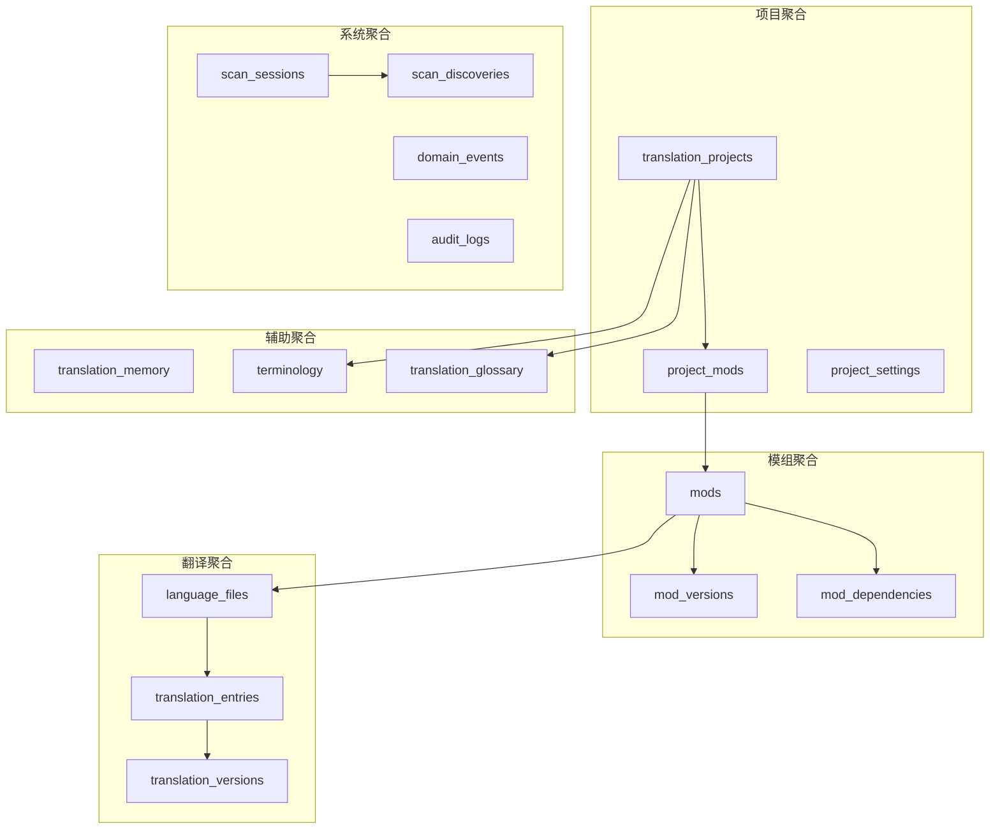

# MC L10n 数据库架构设计 v3.0

**版本**: 3.0.0  
**更新日期**: 2025-09-06  
**架构类型**: DDD (Domain-Driven Design) + Event Sourcing  
**数据库**: SQLite with SQLCipher encryption

## 📋 目录

1. [设计原则](#设计原则)
2. [核心聚合](#核心聚合)
3. [数据表结构](#数据表结构)
4. [索引策略](#索引策略)
5. [视图设计](#视图设计)
6. [触发器](#触发器)
7. [性能优化](#性能优化)

---

## 设计原则

### 核心原则
1. **领域驱动设计(DDD)**: 清晰的聚合边界和领域模型
2. **事件溯源(Event Sourcing)**: 记录所有领域事件，支持审计和回溯
3. **CQRS模式**: 读写分离，优化查询性能
4. **数据完整性**: 强外键约束，唯一性约束，CHECK约束
5. **性能优先**: 合理的索引设计，物化视图，查询优化

### 技术特性
- **增量更新**: 通过content_hash检测变更
- **软删除**: 支持数据恢复和历史追踪
- **版本控制**: 翻译内容版本管理
- **批量操作**: 优化的批量插入和更新
- **并发控制**: 乐观锁机制

---

## 核心聚合



---

## 数据表结构

### 1. 项目管理域

#### translation_projects（翻译项目表）
```sql
CREATE TABLE translation_projects (
    project_id TEXT PRIMARY KEY DEFAULT (lower(hex(randomblob(16)))),
    project_code TEXT NOT NULL UNIQUE,  -- 项目代码，如 'atm10', 'rlcraft'
    name TEXT NOT NULL,
    description TEXT,
    game_version TEXT NOT NULL,  -- MC版本，如 '1.20.1'
    mod_loader TEXT NOT NULL CHECK(mod_loader IN ('forge', 'fabric', 'quilt', 'neoforge')),
    source_language TEXT NOT NULL DEFAULT 'en_us',
    target_languages TEXT NOT NULL DEFAULT '["zh_cn"]',  -- JSON数组
    status TEXT NOT NULL DEFAULT 'active' CHECK(status IN ('active', 'paused', 'completed', 'archived')),
    
    -- 配置
    settings TEXT DEFAULT '{}',  -- JSON配置
    translation_rules TEXT DEFAULT '{}',  -- 翻译规则JSON
    quality_standards TEXT DEFAULT '{}',  -- 质量标准JSON
    
    -- 统计
    total_mods INTEGER DEFAULT 0,
    total_entries INTEGER DEFAULT 0,
    translated_entries INTEGER DEFAULT 0,
    reviewed_entries INTEGER DEFAULT 0,
    completion_rate REAL DEFAULT 0.0,
    
    -- 元数据
    created_by TEXT,
    created_at TIMESTAMP DEFAULT CURRENT_TIMESTAMP,
    updated_at TIMESTAMP DEFAULT CURRENT_TIMESTAMP,
    version INTEGER DEFAULT 1  -- 乐观锁
);

CREATE INDEX idx_projects_code ON translation_projects(project_code);
CREATE INDEX idx_projects_status ON translation_projects(status);
CREATE INDEX idx_projects_game_version ON translation_projects(game_version);
```

#### project_settings（项目设置表）
```sql
CREATE TABLE project_settings (
    setting_id TEXT PRIMARY KEY DEFAULT (lower(hex(randomblob(16)))),
    project_id TEXT NOT NULL,
    setting_key TEXT NOT NULL,
    setting_value TEXT NOT NULL,
    setting_type TEXT DEFAULT 'string',  -- string, number, boolean, json
    description TEXT,
    is_system BOOLEAN DEFAULT FALSE,
    created_at TIMESTAMP DEFAULT CURRENT_TIMESTAMP,
    updated_at TIMESTAMP DEFAULT CURRENT_TIMESTAMP,
    
    FOREIGN KEY (project_id) REFERENCES translation_projects(project_id) ON DELETE CASCADE,
    UNIQUE(project_id, setting_key)
);

CREATE INDEX idx_project_settings_project ON project_settings(project_id);
```

### 2. 模组域

#### mods（模组主表）
```sql
CREATE TABLE mods (
    mod_id TEXT PRIMARY KEY,  -- 使用模组的实际ID
    curseforge_id TEXT,  -- CurseForge ID
    modrinth_id TEXT,  -- Modrinth ID
    
    -- 基本信息
    name TEXT NOT NULL,
    display_name TEXT,
    author TEXT,
    description TEXT,
    homepage_url TEXT,
    source_url TEXT,
    issues_url TEXT,
    
    -- 技术信息
    latest_version TEXT,
    mod_loader TEXT CHECK(mod_loader IN ('forge', 'fabric', 'quilt', 'neoforge', 'unknown')),
    supported_versions TEXT,  -- JSON数组，如 ["1.20.1", "1.20.2"]
    dependencies TEXT,  -- JSON对象
    
    -- 文件信息
    latest_file_path TEXT,
    latest_file_hash TEXT,
    latest_file_size INTEGER,
    
    -- 统计
    total_downloads INTEGER DEFAULT 0,
    popularity_score REAL DEFAULT 0.0,
    
    -- 元数据
    tags TEXT,  -- JSON数组
    categories TEXT,  -- JSON数组
    metadata TEXT DEFAULT '{}',  -- 额外的JSON元数据
    
    -- 时间戳
    first_seen_at TIMESTAMP DEFAULT CURRENT_TIMESTAMP,
    last_updated_at TIMESTAMP DEFAULT CURRENT_TIMESTAMP,
    last_scanned_at TIMESTAMP
);

CREATE INDEX idx_mods_name ON mods(name);
CREATE INDEX idx_mods_loader ON mods(mod_loader);
CREATE INDEX idx_mods_curseforge ON mods(curseforge_id);
CREATE INDEX idx_mods_modrinth ON mods(modrinth_id);
```

#### mod_versions（模组版本表）
```sql
CREATE TABLE mod_versions (
    version_id TEXT PRIMARY KEY DEFAULT (lower(hex(randomblob(16)))),
    mod_id TEXT NOT NULL,
    version_number TEXT NOT NULL,
    minecraft_version TEXT NOT NULL,
    mod_loader TEXT,
    
    -- 文件信息
    file_name TEXT NOT NULL,
    file_path TEXT,
    file_hash TEXT NOT NULL,
    file_size INTEGER,
    download_url TEXT,
    
    -- 版本信息
    release_type TEXT CHECK(release_type IN ('release', 'beta', 'alpha')),
    changelog TEXT,
    dependencies TEXT,  -- JSON
    
    -- 扫描信息
    is_scanned BOOLEAN DEFAULT FALSE,
    scan_result TEXT,  -- JSON
    language_stats TEXT,  -- JSON: {"en_us": 100, "zh_cn": 50}
    
    -- 时间戳
    released_at TIMESTAMP,
    scanned_at TIMESTAMP,
    created_at TIMESTAMP DEFAULT CURRENT_TIMESTAMP,
    
    FOREIGN KEY (mod_id) REFERENCES mods(mod_id) ON DELETE CASCADE,
    UNIQUE(mod_id, version_number, minecraft_version)
);

CREATE INDEX idx_mod_versions_mod ON mod_versions(mod_id);
CREATE INDEX idx_mod_versions_mc ON mod_versions(minecraft_version);
CREATE INDEX idx_mod_versions_hash ON mod_versions(file_hash);
```

#### project_mods（项目-模组关联表）
```sql
CREATE TABLE project_mods (
    project_id TEXT NOT NULL,
    mod_id TEXT NOT NULL,
    version_id TEXT,  -- 特定版本，NULL表示最新版本
    
    -- 状态管理
    is_active BOOLEAN DEFAULT TRUE,
    is_locked BOOLEAN DEFAULT FALSE,  -- 锁定版本，不自动更新
    priority INTEGER DEFAULT 0,  -- 翻译优先级
    
    -- 配置
    custom_rules TEXT,  -- 项目级别的模组特定规则
    ignore_keys TEXT,  -- JSON数组，忽略的翻译键
    
    -- 时间戳
    added_at TIMESTAMP DEFAULT CURRENT_TIMESTAMP,
    updated_at TIMESTAMP DEFAULT CURRENT_TIMESTAMP,
    removed_at TIMESTAMP,  -- 软删除
    
    PRIMARY KEY (project_id, mod_id),
    FOREIGN KEY (project_id) REFERENCES translation_projects(project_id) ON DELETE CASCADE,
    FOREIGN KEY (mod_id) REFERENCES mods(mod_id) ON DELETE CASCADE,
    FOREIGN KEY (version_id) REFERENCES mod_versions(version_id) ON DELETE SET NULL
);

CREATE INDEX idx_project_mods_project ON project_mods(project_id);
CREATE INDEX idx_project_mods_mod ON project_mods(mod_id);
CREATE INDEX idx_project_mods_active ON project_mods(is_active);
```

### 3. 翻译内容域

#### language_files（语言文件表）
```sql
CREATE TABLE language_files (
    file_id TEXT PRIMARY KEY DEFAULT (lower(hex(randomblob(16)))),
    mod_id TEXT NOT NULL,
    version_id TEXT,
    
    -- 文件信息
    language_code TEXT NOT NULL,
    file_path TEXT NOT NULL,  -- 在JAR中的路径
    file_format TEXT NOT NULL CHECK(file_format IN ('json', 'lang', 'properties', 'xml')),
    
    -- 内容管理
    content TEXT,  -- 原始内容
    content_hash TEXT NOT NULL,  -- 用于检测变更
    parsed_content TEXT,  -- 解析后的JSON
    
    -- 统计
    entry_count INTEGER DEFAULT 0,
    translated_count INTEGER DEFAULT 0,
    reviewed_count INTEGER DEFAULT 0,
    
    -- 元数据
    encoding TEXT DEFAULT 'UTF-8',
    line_ending TEXT DEFAULT 'LF',  -- LF, CRLF
    
    -- 时间戳
    extracted_at TIMESTAMP DEFAULT CURRENT_TIMESTAMP,
    modified_at TIMESTAMP DEFAULT CURRENT_TIMESTAMP,
    
    FOREIGN KEY (mod_id) REFERENCES mods(mod_id) ON DELETE CASCADE,
    FOREIGN KEY (version_id) REFERENCES mod_versions(version_id) ON DELETE CASCADE,
    UNIQUE(mod_id, version_id, language_code, file_path)
);

CREATE INDEX idx_language_files_mod ON language_files(mod_id);
CREATE INDEX idx_language_files_version ON language_files(version_id);
CREATE INDEX idx_language_files_lang ON language_files(language_code);
CREATE INDEX idx_language_files_hash ON language_files(content_hash);
```

#### translation_entries（翻译条目表）
```sql
CREATE TABLE translation_entries (
    entry_id TEXT PRIMARY KEY DEFAULT (lower(hex(randomblob(16)))),
    file_id TEXT NOT NULL,
    project_id TEXT,
    
    -- 键信息
    translation_key TEXT NOT NULL,
    key_hash TEXT NOT NULL,  -- MD5(mod_id + key)，用于快速查找
    key_type TEXT,  -- item, block, entity, gui, tooltip, message, etc.
    key_category TEXT,  -- 自定义分类
    
    -- 内容
    source_text TEXT NOT NULL,  -- 原文（通常是en_us）
    target_text TEXT,  -- 译文
    machine_translation TEXT,  -- 机器翻译
    suggested_translation TEXT,  -- 建议翻译（来自记忆库）
    
    -- 状态和质量
    status TEXT NOT NULL DEFAULT 'pending' CHECK(status IN (
        'pending',      -- 待翻译
        'translating',  -- 翻译中
        'translated',   -- 已翻译
        'reviewing',    -- 审核中
        'reviewed',     -- 已审核
        'approved',     -- 已批准
        'rejected',     -- 已拒绝
        'outdated'      -- 已过时（原文变更）
    )),
    quality_score REAL DEFAULT 0.0,  -- 0-1的质量分数
    confidence_level REAL DEFAULT 0.0,  -- 翻译置信度
    
    -- 上下文
    context TEXT,  -- 使用上下文
    screenshot_url TEXT,  -- 截图URL
    reference_url TEXT,  -- 参考链接
    notes TEXT,  -- 备注
    
    -- 人员
    translator_id TEXT,
    reviewer_id TEXT,
    approver_id TEXT,
    
    -- 时间戳
    created_at TIMESTAMP DEFAULT CURRENT_TIMESTAMP,
    translated_at TIMESTAMP,
    reviewed_at TIMESTAMP,
    approved_at TIMESTAMP,
    updated_at TIMESTAMP DEFAULT CURRENT_TIMESTAMP,
    
    -- 版本控制
    version INTEGER DEFAULT 1,
    is_locked BOOLEAN DEFAULT FALSE,  -- 锁定，防止自动更新
    
    FOREIGN KEY (file_id) REFERENCES language_files(file_id) ON DELETE CASCADE,
    FOREIGN KEY (project_id) REFERENCES translation_projects(project_id) ON DELETE SET NULL,
    UNIQUE(file_id, translation_key)
);

CREATE INDEX idx_translation_entries_file ON translation_entries(file_id);
CREATE INDEX idx_translation_entries_project ON translation_entries(project_id);
CREATE INDEX idx_translation_entries_key ON translation_entries(translation_key);
CREATE INDEX idx_translation_entries_hash ON translation_entries(key_hash);
CREATE INDEX idx_translation_entries_status ON translation_entries(status);
CREATE INDEX idx_translation_entries_type ON translation_entries(key_type);
```

#### translation_versions（翻译版本历史表）
```sql
CREATE TABLE translation_versions (
    version_id TEXT PRIMARY KEY DEFAULT (lower(hex(randomblob(16)))),
    entry_id TEXT NOT NULL,
    
    -- 版本信息
    version_number INTEGER NOT NULL,
    change_type TEXT CHECK(change_type IN ('create', 'update', 'delete', 'restore')),
    
    -- 内容快照
    source_text TEXT,
    target_text TEXT,
    status TEXT,
    
    -- 变更信息
    changed_by TEXT,
    change_reason TEXT,
    change_diff TEXT,  -- JSON格式的差异
    
    -- 时间戳
    created_at TIMESTAMP DEFAULT CURRENT_TIMESTAMP,
    
    FOREIGN KEY (entry_id) REFERENCES translation_entries(entry_id) ON DELETE CASCADE
);

CREATE INDEX idx_translation_versions_entry ON translation_versions(entry_id);
CREATE INDEX idx_translation_versions_time ON translation_versions(created_at);
```

### 4. 辅助功能域

#### terminology（术语库表）
```sql
CREATE TABLE terminology (
    term_id TEXT PRIMARY KEY DEFAULT (lower(hex(randomblob(16)))),
    project_id TEXT,
    
    -- 术语信息
    term TEXT NOT NULL,
    normalized_term TEXT NOT NULL,  -- 小写，去除特殊字符
    translation TEXT NOT NULL,
    
    -- 分类
    category TEXT,  -- item, block, entity, biome, effect, etc.
    domain TEXT,  -- minecraft, mod_specific, technical, general
    part_of_speech TEXT,  -- noun, verb, adjective
    
    -- 属性
    is_proper_noun BOOLEAN DEFAULT FALSE,
    is_translatable BOOLEAN DEFAULT TRUE,
    priority INTEGER DEFAULT 0,
    
    -- 使用规则
    usage_context TEXT,
    usage_examples TEXT,  -- JSON数组
    notes TEXT,
    
    -- 统计
    usage_count INTEGER DEFAULT 0,
    last_used_at TIMESTAMP,
    
    -- 元数据
    source TEXT,  -- 来源：manual, imported, extracted
    created_by TEXT,
    approved_by TEXT,
    created_at TIMESTAMP DEFAULT CURRENT_TIMESTAMP,
    updated_at TIMESTAMP DEFAULT CURRENT_TIMESTAMP,
    
    FOREIGN KEY (project_id) REFERENCES translation_projects(project_id) ON DELETE CASCADE,
    UNIQUE(project_id, normalized_term)
);

CREATE INDEX idx_terminology_project ON terminology(project_id);
CREATE INDEX idx_terminology_term ON terminology(normalized_term);
CREATE INDEX idx_terminology_category ON terminology(category);
```

#### translation_memory（翻译记忆库表）
```sql
CREATE TABLE translation_memory (
    memory_id TEXT PRIMARY KEY DEFAULT (lower(hex(randomblob(16)))),
    
    -- 内容
    source_text TEXT NOT NULL,
    source_hash TEXT NOT NULL,  -- MD5(source_text)
    target_text TEXT NOT NULL,
    source_language TEXT DEFAULT 'en_us',
    target_language TEXT DEFAULT 'zh_cn',
    
    -- 关联
    project_id TEXT,
    mod_id TEXT,
    entry_id TEXT,
    
    -- 质量和相似度
    quality_score REAL DEFAULT 0.5,  -- 0-1
    usage_count INTEGER DEFAULT 0,
    success_rate REAL DEFAULT 0.0,  -- 采用率
    
    -- 上下文
    context TEXT,
    domain TEXT,
    metadata TEXT,  -- JSON
    
    -- 时间戳
    created_at TIMESTAMP DEFAULT CURRENT_TIMESTAMP,
    last_used_at TIMESTAMP,
    verified_at TIMESTAMP,
    
    FOREIGN KEY (project_id) REFERENCES translation_projects(project_id) ON DELETE SET NULL,
    FOREIGN KEY (mod_id) REFERENCES mods(mod_id) ON DELETE SET NULL,
    FOREIGN KEY (entry_id) REFERENCES translation_entries(entry_id) ON DELETE SET NULL
);

CREATE INDEX idx_memory_source_hash ON translation_memory(source_hash);
CREATE INDEX idx_memory_project ON translation_memory(project_id);
CREATE INDEX idx_memory_quality ON translation_memory(quality_score DESC);
CREATE INDEX idx_memory_usage ON translation_memory(usage_count DESC);
-- 全文搜索索引
CREATE VIRTUAL TABLE translation_memory_fts USING fts5(
    source_text, target_text, context,
    content=translation_memory
);
```

### 5. 系统管理域

#### scan_sessions（扫描会话表）
```sql
CREATE TABLE scan_sessions (
    scan_id TEXT PRIMARY KEY DEFAULT (lower(hex(randomblob(16)))),
    project_id TEXT,
    
    -- 扫描配置
    scan_type TEXT NOT NULL CHECK(scan_type IN ('full', 'incremental', 'selective', 'verify')),
    scan_mode TEXT DEFAULT 'normal' CHECK(scan_mode IN ('normal', 'quick', 'deep')),
    target_path TEXT NOT NULL,
    file_patterns TEXT,  -- JSON数组
    
    -- 状态
    status TEXT NOT NULL DEFAULT 'pending' CHECK(status IN (
        'pending', 'preparing', 'scanning', 'processing', 
        'completed', 'failed', 'cancelled'
    )),
    progress_percent REAL DEFAULT 0.0,
    current_file TEXT,
    
    -- 统计
    total_files INTEGER DEFAULT 0,
    scanned_files INTEGER DEFAULT 0,
    discovered_mods INTEGER DEFAULT 0,
    new_mods INTEGER DEFAULT 0,
    updated_mods INTEGER DEFAULT 0,
    total_entries INTEGER DEFAULT 0,
    new_entries INTEGER DEFAULT 0,
    
    -- 性能指标
    scan_speed REAL,  -- 文件/秒
    memory_usage INTEGER,  -- MB
    
    -- 结果
    result_summary TEXT,  -- JSON
    error_log TEXT,  -- JSON数组
    warnings TEXT,  -- JSON数组
    
    -- 时间戳
    scheduled_at TIMESTAMP,
    started_at TIMESTAMP,
    completed_at TIMESTAMP,
    duration_seconds INTEGER,
    
    FOREIGN KEY (project_id) REFERENCES translation_projects(project_id) ON DELETE CASCADE
);

CREATE INDEX idx_scan_sessions_project ON scan_sessions(project_id);
CREATE INDEX idx_scan_sessions_status ON scan_sessions(status);
CREATE INDEX idx_scan_sessions_time ON scan_sessions(started_at DESC);
```

#### domain_events（领域事件表）
```sql
CREATE TABLE domain_events (
    event_id TEXT PRIMARY KEY DEFAULT (lower(hex(randomblob(16)))),
    event_type TEXT NOT NULL,
    event_version INTEGER DEFAULT 1,
    
    -- 聚合信息
    aggregate_type TEXT NOT NULL,
    aggregate_id TEXT NOT NULL,
    
    -- 事件数据
    event_data TEXT NOT NULL,  -- JSON
    event_metadata TEXT,  -- JSON
    
    -- 关联
    correlation_id TEXT,  -- 关联多个事件
    causation_id TEXT,  -- 因果关系
    
    -- 处理状态
    is_processed BOOLEAN DEFAULT FALSE,
    processed_at TIMESTAMP,
    process_error TEXT,
    
    -- 审计
    user_id TEXT,
    session_id TEXT,
    ip_address TEXT,
    user_agent TEXT,
    
    -- 时间戳
    occurred_at TIMESTAMP DEFAULT CURRENT_TIMESTAMP,
    
    CHECK(json_valid(event_data))
);

CREATE INDEX idx_events_type ON domain_events(event_type);
CREATE INDEX idx_events_aggregate ON domain_events(aggregate_type, aggregate_id);
CREATE INDEX idx_events_time ON domain_events(occurred_at DESC);
CREATE INDEX idx_events_correlation ON domain_events(correlation_id);
CREATE INDEX idx_events_processed ON domain_events(is_processed);
```

---

## 索引策略

### 主键索引
- 所有主键自动创建唯一索引
- 使用UUID（16字节hex）作为主键，保证全局唯一

### 外键索引
- 所有外键字段创建索引，优化JOIN查询
- 支持级联删除和更新

### 查询优化索引
```sql
-- 复合索引
CREATE INDEX idx_entries_project_status ON translation_entries(project_id, status);
CREATE INDEX idx_files_mod_lang ON language_files(mod_id, language_code);
CREATE INDEX idx_project_mods_active_priority ON project_mods(project_id, is_active, priority DESC);

-- 覆盖索引
CREATE INDEX idx_entries_covering ON translation_entries(
    project_id, status, key_type
) WHERE status IN ('pending', 'translating');

-- 部分索引
CREATE INDEX idx_entries_pending ON translation_entries(project_id) 
WHERE status = 'pending';

CREATE INDEX idx_mods_active ON project_mods(project_id, mod_id) 
WHERE is_active = TRUE AND removed_at IS NULL;
```

---

## 视图设计

### 项目统计视图
```sql
CREATE VIEW v_project_statistics AS
SELECT 
    p.project_id,
    p.project_code,
    p.name,
    p.status,
    COUNT(DISTINCT pm.mod_id) as mod_count,
    COUNT(DISTINCT te.entry_id) as total_entries,
    SUM(CASE WHEN te.status = 'translated' THEN 1 ELSE 0 END) as translated_count,
    SUM(CASE WHEN te.status = 'reviewed' THEN 1 ELSE 0 END) as reviewed_count,
    SUM(CASE WHEN te.status = 'approved' THEN 1 ELSE 0 END) as approved_count,
    ROUND(
        CAST(SUM(CASE WHEN te.status IN ('translated', 'reviewed', 'approved') THEN 1 ELSE 0 END) AS REAL) 
        / NULLIF(COUNT(te.entry_id), 0) * 100, 
        2
    ) as completion_rate
FROM translation_projects p
LEFT JOIN project_mods pm ON p.project_id = pm.project_id AND pm.is_active = TRUE
LEFT JOIN translation_entries te ON p.project_id = te.project_id
GROUP BY p.project_id;
```

### 模组翻译进度视图
```sql
CREATE VIEW v_mod_translation_progress AS
SELECT 
    m.mod_id,
    m.name as mod_name,
    m.display_name,
    mv.version_number,
    lf.language_code,
    COUNT(te.entry_id) as total_entries,
    SUM(CASE WHEN te.status IN ('translated', 'reviewed', 'approved') THEN 1 ELSE 0 END) as translated_entries,
    ROUND(
        CAST(SUM(CASE WHEN te.status IN ('translated', 'reviewed', 'approved') THEN 1 ELSE 0 END) AS REAL) 
        / NULLIF(COUNT(te.entry_id), 0) * 100, 
        2
    ) as progress_percent
FROM mods m
JOIN mod_versions mv ON m.mod_id = mv.mod_id
JOIN language_files lf ON mv.version_id = lf.version_id
LEFT JOIN translation_entries te ON lf.file_id = te.file_id
GROUP BY m.mod_id, mv.version_id, lf.language_code;
```

### 翻译质量视图
```sql
CREATE VIEW v_translation_quality AS
SELECT 
    p.project_id,
    p.name as project_name,
    COUNT(te.entry_id) as total_entries,
    AVG(te.quality_score) as avg_quality_score,
    AVG(te.confidence_level) as avg_confidence,
    SUM(CASE WHEN te.quality_score >= 0.8 THEN 1 ELSE 0 END) as high_quality_count,
    SUM(CASE WHEN te.quality_score < 0.5 THEN 1 ELSE 0 END) as low_quality_count,
    SUM(CASE WHEN te.is_locked THEN 1 ELSE 0 END) as locked_count
FROM translation_projects p
JOIN translation_entries te ON p.project_id = te.project_id
WHERE te.status IN ('translated', 'reviewed', 'approved')
GROUP BY p.project_id;
```

---

## 触发器

### 自动更新时间戳
```sql
-- 更新 updated_at 字段
CREATE TRIGGER update_projects_timestamp 
AFTER UPDATE ON translation_projects
BEGIN
    UPDATE translation_projects 
    SET updated_at = CURRENT_TIMESTAMP 
    WHERE project_id = NEW.project_id;
END;

-- 类似触发器应用于所有包含 updated_at 的表
```

### 统计更新触发器
```sql
-- 更新项目统计
CREATE TRIGGER update_project_stats 
AFTER INSERT OR UPDATE OR DELETE ON translation_entries
BEGIN
    UPDATE translation_projects 
    SET 
        total_entries = (
            SELECT COUNT(*) FROM translation_entries 
            WHERE project_id = NEW.project_id
        ),
        translated_entries = (
            SELECT COUNT(*) FROM translation_entries 
            WHERE project_id = NEW.project_id 
            AND status IN ('translated', 'reviewed', 'approved')
        ),
        completion_rate = (
            SELECT ROUND(
                CAST(SUM(CASE WHEN status IN ('translated', 'reviewed', 'approved') THEN 1 ELSE 0 END) AS REAL) 
                / NULLIF(COUNT(*), 0) * 100, 2
            )
            FROM translation_entries 
            WHERE project_id = NEW.project_id
        )
    WHERE project_id = NEW.project_id;
END;
```

### 领域事件记录触发器
```sql
-- 记录重要变更事件
CREATE TRIGGER record_translation_change 
AFTER UPDATE ON translation_entries
WHEN OLD.status != NEW.status
BEGIN
    INSERT INTO domain_events (
        event_type,
        aggregate_type,
        aggregate_id,
        event_data
    ) VALUES (
        'TranslationStatusChanged',
        'TranslationEntry',
        NEW.entry_id,
        json_object(
            'old_status', OLD.status,
            'new_status', NEW.status,
            'translator_id', NEW.translator_id,
            'project_id', NEW.project_id
        )
    );
END;
```

---

## 性能优化

### 查询优化建议
1. **使用预编译语句**: 防止SQL注入，提高性能
2. **批量操作**: INSERT OR REPLACE 批量插入
3. **分页查询**: 使用 LIMIT 和 OFFSET
4. **延迟加载**: 大文本字段按需加载
5. **连接池**: 维护数据库连接池

### 数据库配置
```sql
-- WAL模式，提高并发性能
PRAGMA journal_mode = WAL;

-- 内存缓存大小 (32MB)
PRAGMA cache_size = -32000;

-- 临时存储在内存
PRAGMA temp_store = MEMORY;

-- 同步模式
PRAGMA synchronous = NORMAL;

-- 外键约束
PRAGMA foreign_keys = ON;

-- 自动索引
PRAGMA automatic_index = ON;

-- 查询优化
PRAGMA optimize;
```

### 定期维护
```sql
-- 每周执行
VACUUM;  -- 压缩数据库
ANALYZE;  -- 更新统计信息
PRAGMA optimize;  -- 优化查询计划
```

---

## 数据完整性约束

### 业务规则约束
```sql
-- 确保项目必须有至少一个目标语言
CREATE TRIGGER check_target_languages 
BEFORE INSERT OR UPDATE ON translation_projects
BEGIN
    SELECT CASE 
        WHEN json_array_length(NEW.target_languages) = 0 
        THEN RAISE(ABORT, 'Project must have at least one target language')
    END;
END;

-- 确保翻译状态转换合法
CREATE TRIGGER check_status_transition 
BEFORE UPDATE ON translation_entries
WHEN OLD.status != NEW.status
BEGIN
    SELECT CASE
        WHEN OLD.status = 'approved' AND NEW.status != 'outdated'
        THEN RAISE(ABORT, 'Approved translations can only be marked as outdated')
        WHEN OLD.status = 'pending' AND NEW.status NOT IN ('translating', 'translated')
        THEN RAISE(ABORT, 'Invalid status transition')
    END;
END;
```

---

## 安全性设计

### 数据加密
- 使用 SQLCipher 进行透明加密
- 敏感字段（如API密钥）额外加密

### 访问控制
- 基于角色的访问控制（RBAC）
- 行级安全（RLS）通过视图实现

### 审计日志
- 所有写操作记录到 domain_events
- 敏感操作额外记录到 audit_logs

---

## 备份策略

### 自动备份
```sql
-- 创建备份表
CREATE TABLE backup_metadata (
    backup_id TEXT PRIMARY KEY,
    backup_type TEXT,  -- full, incremental, snapshot
    backup_path TEXT,
    backup_size INTEGER,
    created_at TIMESTAMP DEFAULT CURRENT_TIMESTAMP,
    verified_at TIMESTAMP,
    is_valid BOOLEAN DEFAULT TRUE
);
```

### 备份脚本
```bash
#!/bin/bash
# 每日备份
sqlite3 mc_l10n.db ".backup 'backups/mc_l10n_$(date +%Y%m%d).db'"

# 增量备份（使用WAL）
cp mc_l10n.db-wal "backups/wal_$(date +%Y%m%d_%H%M%S).wal"
```

---

## 版本历史

| 版本 | 日期 | 主要变更 |
|------|------|----------|
| 3.0.0 | 2025-09-06 | 完整的DDD架构设计，增加事件溯源，优化性能 |
| 2.0.0 | 2025-09-05 | 基础DDD架构 |
| 1.0.0 | 2025-09-04 | 初始版本 |