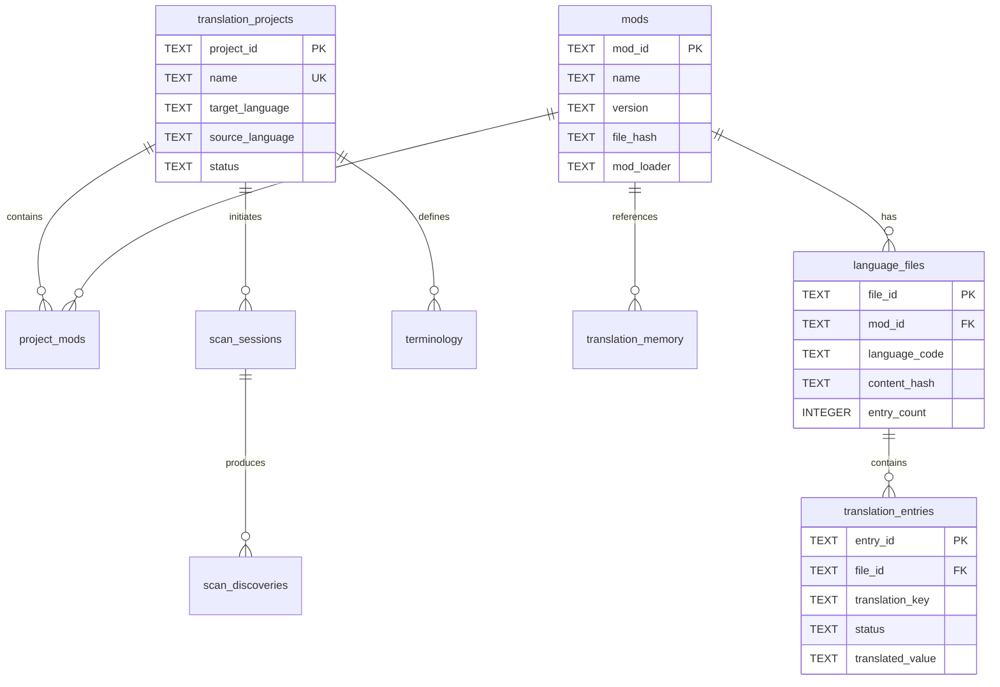

# MC L10n 数据库架构文档

**版本**: 2.0.0  
**更新日期**: 2025-09-05  
**架构类型**: DDD (Domain-Driven Design)  
**数据库文件**: `mc_l10n_ddd.db`

## 📋 目录

1. [概述](#概述)
2. [核心聚合](#核心聚合)
3. [数据表结构](#数据表结构)
4. [视图](#视图)
5. [索引](#索引)
6. [关系图](#关系图)

---

## 概述

MC L10n 数据库采用领域驱动设计(DDD)架构，围绕翻译项目管理的核心业务构建。数据库设计遵循以下原则：

- **聚合边界清晰**: 每个聚合有明确的边界和职责
- **数据一致性**: 通过外键约束和唯一索引保证数据完整性
- **UPSERT支持**: 避免数据重复，支持增量更新
- **性能优化**: 合理的索引设计，支持快速查询

---

## 核心聚合

### 1. 翻译项目聚合 (Translation Project Aggregate)
- **聚合根**: `translation_projects`
- **职责**: 管理翻译项目生命周期，协调模组和翻译内容

### 2. 模组聚合 (Mod Aggregate)  
- **聚合根**: `mods`
- **职责**: 管理模组信息、文件结构和语言内容

### 3. 翻译条目聚合 (Translation Entry Aggregate)
- **聚合根**: `translation_entries`
- **职责**: 管理具体的翻译键值对

---

## 数据表结构

### 1. translation_projects (翻译项目表)

**描述**: 存储翻译项目的基本信息和配置

| 字段名 | 类型 | 约束 | 描述 |
|--------|------|------|------|
| project_id | TEXT | PRIMARY KEY | 项目唯一标识符 |
| name | TEXT | NOT NULL, UNIQUE | 项目名称 |
| description | TEXT | - | 项目描述 |
| target_language | TEXT | NOT NULL | 目标语言(默认: zh_cn) |
| source_language | TEXT | NOT NULL | 源语言(默认: en_us) |
| status | TEXT | DEFAULT 'active' | 项目状态(active/completed/archived) |
| settings | TEXT | - | JSON格式的项目设置 |
| statistics | TEXT | - | JSON格式的统计信息 |
| created_at | TIMESTAMP | DEFAULT CURRENT | 创建时间 |
| updated_at | TIMESTAMP | DEFAULT CURRENT | 更新时间 |

---

### 2. mods (模组表)

**描述**: 存储Minecraft模组的元数据信息

| 字段名 | 类型 | 约束 | 描述 |
|--------|------|------|------|
| mod_id | TEXT | PRIMARY KEY | 模组唯一标识符 |
| name | TEXT | NOT NULL | 模组名称 |
| display_name | TEXT | - | 显示名称 |
| version | TEXT | - | 模组版本 |
| minecraft_version | TEXT | - | 支持的MC版本 |
| mod_loader | TEXT | - | 加载器类型(forge/fabric/quilt) |
| file_path | TEXT | - | JAR文件路径 |
| file_hash | TEXT | - | 文件MD5哈希 |
| metadata | TEXT | - | JSON格式的元数据 |
| scan_result | TEXT | - | JSON格式的扫描结果 |
| created_at | TIMESTAMP | DEFAULT CURRENT | 创建时间 |
| updated_at | TIMESTAMP | DEFAULT CURRENT | 更新时间 |

**特性**:
- 使用file_hash检测文件变更
- 支持UPSERT操作避免重复

---

### 3. project_mods (项目-模组关联表)

**描述**: 管理项目和模组的多对多关系

| 字段名 | 类型 | 约束 | 描述 |
|--------|------|------|------|
| project_id | TEXT | NOT NULL, FK | 项目ID |
| mod_id | TEXT | NOT NULL, FK | 模组ID |
| added_at | TIMESTAMP | DEFAULT CURRENT | 添加时间 |
| removed_at | TIMESTAMP | - | 移除时间(软删除) |
| is_active | BOOLEAN | DEFAULT TRUE | 是否激活 |

**约束**:
- PRIMARY KEY (project_id, mod_id)
- FOREIGN KEY (project_id) REFERENCES translation_projects
- FOREIGN KEY (mod_id) REFERENCES mods

---

### 4. language_files (语言文件表)

**描述**: 存储模组的语言文件信息

| 字段名 | 类型 | 约束 | 描述 |
|--------|------|------|------|
| file_id | TEXT | PRIMARY KEY | 文件唯一标识符 |
| mod_id | TEXT | NOT NULL, FK | 所属模组ID |
| language_code | TEXT | NOT NULL | 语言代码(en_us/zh_cn等) |
| file_path | TEXT | - | 在JAR中的相对路径 |
| file_format | TEXT | DEFAULT 'json' | 文件格式(json/properties) |
| content_hash | TEXT | - | 内容MD5哈希 |
| entry_count | INTEGER | DEFAULT 0 | 条目数量 |
| last_modified | TIMESTAMP | DEFAULT CURRENT | 最后修改时间 |

**约束**:
- UNIQUE(mod_id, language_code) - 每个模组每种语言只有一个文件
- FOREIGN KEY (mod_id) REFERENCES mods

---

### 5. translation_entries (翻译条目表)

**描述**: 存储具体的翻译键值对

| 字段名 | 类型 | 约束 | 描述 |
|--------|------|------|------|
| entry_id | TEXT | PRIMARY KEY | 条目唯一标识符 |
| file_id | TEXT | NOT NULL, FK | 所属语言文件ID |
| translation_key | TEXT | NOT NULL | 翻译键 |
| key_type | TEXT | - | 键类型(item/block/gui/tooltip) |
| original_value | TEXT | - | 原文 |
| translated_value | TEXT | - | 译文 |
| machine_translation | TEXT | - | 机器翻译 |
| status | TEXT | DEFAULT 'untranslated' | 状态(见下表) |
| translator | TEXT | - | 翻译者 |
| reviewer | TEXT | - | 审核者 |
| context | TEXT | - | 上下文信息 |
| notes | TEXT | - | 备注 |
| created_at | TIMESTAMP | DEFAULT CURRENT | 创建时间 |
| last_modified | TIMESTAMP | DEFAULT CURRENT | 最后修改时间 |

**约束**:
- UNIQUE(file_id, translation_key) - 每个文件每个键唯一
- FOREIGN KEY (file_id) REFERENCES language_files

**状态值**:
- `untranslated` - 未翻译
- `translated` - 已翻译
- `reviewed` - 已审核
- `approved` - 已批准
- `deleted` - 已删除(原文件中不存在)

---

### 6. terminology (术语库表)

**描述**: 存储项目级别的术语翻译

| 字段名 | 类型 | 约束 | 描述 |
|--------|------|------|------|
| term_id | TEXT | PRIMARY KEY | 术语ID |
| project_id | TEXT | FK | 所属项目 |
| term | TEXT | NOT NULL | 原文术语 |
| translation | TEXT | NOT NULL | 译文 |
| category | TEXT | - | 分类(item/block/entity) |
| description | TEXT | - | 描述 |
| usage_count | INTEGER | DEFAULT 0 | 使用次数 |
| created_by | TEXT | - | 创建者 |
| created_at | TIMESTAMP | DEFAULT CURRENT | 创建时间 |

---

### 7. translation_memory (翻译记忆库)

**描述**: 存储历史翻译用于辅助翻译

| 字段名 | 类型 | 约束 | 描述 |
|--------|------|------|------|
| memory_id | TEXT | PRIMARY KEY | 记忆ID |
| source_text | TEXT | NOT NULL | 源文本 |
| target_text | TEXT | NOT NULL | 目标文本 |
| source_language | TEXT | DEFAULT 'en_us' | 源语言 |
| target_language | TEXT | DEFAULT 'zh_cn' | 目标语言 |
| context | TEXT | - | 上下文 |
| mod_id | TEXT | FK | 关联模组 |
| quality_score | REAL | DEFAULT 0.0 | 质量评分(0-1) |
| usage_count | INTEGER | DEFAULT 0 | 使用次数 |
| created_at | TIMESTAMP | DEFAULT CURRENT | 创建时间 |

---

### 8. scan_sessions (扫描会话表)

**描述**: 记录扫描任务的执行情况

| 字段名 | 类型 | 约束 | 描述 |
|--------|------|------|------|
| scan_id | TEXT | PRIMARY KEY | 扫描ID |
| project_id | TEXT | FK | 关联项目 |
| scan_type | TEXT | DEFAULT 'full' | 扫描类型(full/incremental) |
| target_path | TEXT | NOT NULL | 扫描路径 |
| status | TEXT | DEFAULT 'pending' | 状态 |
| progress_percent | REAL | DEFAULT 0 | 进度百分比 |
| statistics | TEXT | - | JSON格式的统计 |
| error_message | TEXT | - | 错误信息 |
| started_at | TIMESTAMP | DEFAULT CURRENT | 开始时间 |
| completed_at | TIMESTAMP | - | 完成时间 |

---

### 9. scan_discoveries (扫描发现表)

**描述**: 临时存储扫描发现的模组信息

| 字段名 | 类型 | 约束 | 描述 |
|--------|------|------|------|
| discovery_id | TEXT | PRIMARY KEY | 发现ID |
| scan_id | TEXT | NOT NULL, FK | 扫描会话ID |
| mod_id | TEXT | - | 模组ID |
| mod_name | TEXT | - | 模组名称 |
| mod_version | TEXT | - | 模组版本 |
| file_path | TEXT | - | 文件路径 |
| file_size | INTEGER | - | 文件大小(字节) |
| language_files_count | INTEGER | DEFAULT 0 | 语言文件数 |
| total_keys | INTEGER | DEFAULT 0 | 翻译键总数 |
| is_processed | BOOLEAN | DEFAULT FALSE | 是否已处理 |
| discovered_at | TIMESTAMP | DEFAULT CURRENT | 发现时间 |

---

### 10. domain_events (领域事件表)

**描述**: 记录系统中发生的领域事件

| 字段名 | 类型 | 约束 | 描述 |
|--------|------|------|------|
| event_id | TEXT | PRIMARY KEY | 事件ID |
| event_type | TEXT | NOT NULL | 事件类型 |
| aggregate_id | TEXT | - | 聚合ID |
| aggregate_type | TEXT | - | 聚合类型 |
| event_data | TEXT | - | JSON格式的事件数据 |
| occurred_at | TIMESTAMP | DEFAULT CURRENT | 发生时间 |
| processed_at | TIMESTAMP | - | 处理时间 |

---

## 视图

### 1. v_mod_statistics (模组统计视图)

**描述**: 提供模组的聚合统计信息

```sql
CREATE VIEW v_mod_statistics AS
SELECT 
    m.mod_id,
    m.name as mod_name,
    m.version,
    m.mod_loader,
    COUNT(DISTINCT lf.language_code) as language_count,
    SUM(lf.entry_count) as total_entries,
    MAX(lf.last_modified) as last_updated
FROM mods m
LEFT JOIN language_files lf ON m.mod_id = lf.mod_id
GROUP BY m.mod_id;
```

### 2. v_project_progress (项目进度视图)

**描述**: 提供项目的翻译进度统计

```sql
CREATE VIEW v_project_progress AS
SELECT 
    p.project_id,
    p.name as project_name,
    COUNT(DISTINCT pm.mod_id) as mod_count,
    COUNT(DISTINCT te.entry_id) as total_entries,
    SUM(CASE WHEN te.status = 'translated' THEN 1 ELSE 0 END) as translated_count,
    SUM(CASE WHEN te.status = 'approved' THEN 1 ELSE 0 END) as approved_count,
    CAST(SUM(CASE WHEN te.status IN ('translated', 'approved') THEN 1 ELSE 0 END) AS REAL) 
        / NULLIF(COUNT(te.entry_id), 0) * 100 as completion_percent
FROM translation_projects p
LEFT JOIN project_mods pm ON p.project_id = pm.project_id
LEFT JOIN language_files lf ON pm.mod_id = lf.mod_id
LEFT JOIN translation_entries te ON lf.file_id = te.file_id
GROUP BY p.project_id;
```

---

## 索引

### 性能优化索引列表

| 表名 | 索引名 | 字段 | 用途 |
|------|--------|------|------|
| mods | idx_mods_name | name | 按名称查询 |
| mods | idx_mods_version | version | 版本过滤 |
| mods | idx_mods_loader | mod_loader | 加载器类型过滤 |
| language_files | idx_language_files_mod | mod_id | 模组关联查询 |
| language_files | idx_language_files_lang | language_code | 语言过滤 |
| translation_entries | idx_entries_file | file_id | 文件关联查询 |
| translation_entries | idx_entries_key | translation_key | 键查找 |
| translation_entries | idx_entries_status | status | 状态过滤 |
| translation_memory | idx_memory_source | source_text | 相似文本搜索 |
| translation_memory | idx_memory_languages | source_language, target_language | 语言对过滤 |
| scan_sessions | idx_scan_project | project_id | 项目扫描历史 |
| scan_sessions | idx_scan_status | status | 状态过滤 |
| scan_discoveries | idx_discoveries_scan | scan_id | 扫描结果查询 |

---

## 关系图



---

## 使用说明

### 1. UPSERT操作示例

```sql
-- 插入或更新模组
INSERT OR REPLACE INTO mods (
    mod_id, name, version, file_hash
) VALUES (?, ?, ?, ?);

-- 插入或忽略项目关联
INSERT OR IGNORE INTO project_mods (
    project_id, mod_id
) VALUES (?, ?);
```

### 2. 查询示例

```sql
-- 获取项目的翻译进度
SELECT * FROM v_project_progress 
WHERE project_id = 'default-project';

-- 查找未翻译的条目
SELECT te.* FROM translation_entries te
JOIN language_files lf ON te.file_id = lf.file_id
WHERE lf.language_code = 'zh_cn' 
  AND te.status = 'untranslated';
```

### 3. 数据完整性保证

- 所有外键关系都启用了 CASCADE 删除
- 关键字段设置了 UNIQUE 约束
- 使用事务保证操作原子性
- 文件哈希用于检测变更

---

## 版本历史

| 版本 | 日期 | 变更说明 |
|------|------|----------|
| 2.0.0 | 2025-09-05 | 完全重构为DDD架构 |
| 1.0.0 | 2025-09-04 | 初始版本 |

---

## 相关文档

- [领域模型设计](../architecture/mc-domain-model-design.md)
- [API接口文档](./api-documentation.md)
- [部署指南](../deployment/deployment-guide.md)