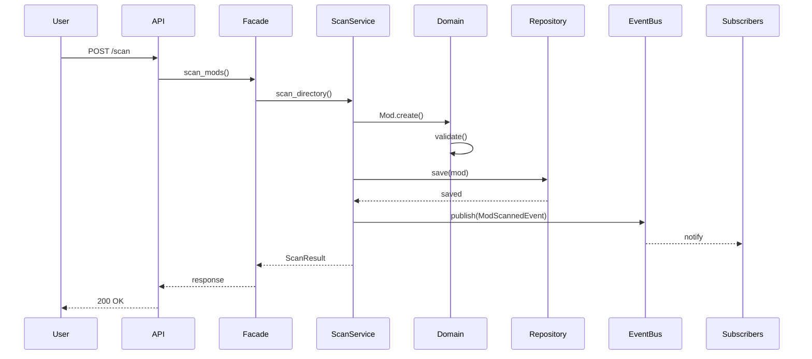
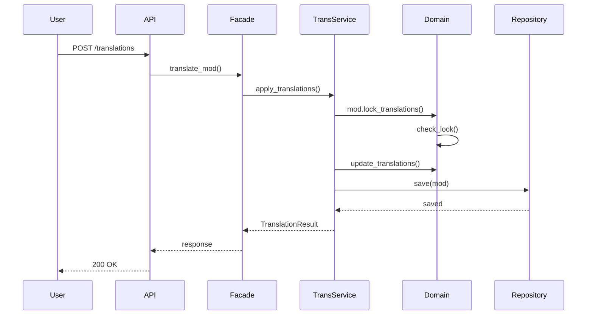

# MC L10n v6.0 架构设计文档

## 目录

1. [架构概述](#架构概述)
2. [设计原则](#设计原则)
3. [六边形架构](#六边形架构)
4. [领域驱动设计](#领域驱动设计)
5. [技术架构](#技术架构)
6. [数据流](#数据流)
7. [部署架构](#部署架构)

## 架构概述

MC L10n v6.0 采用**六边形架构（Hexagonal Architecture）**结合**领域驱动设计（DDD）**，实现了高度解耦、可测试和可维护的系统架构。

### 核心特点

- **业务与技术分离**: 核心业务逻辑独立于技术实现
- **端口与适配器**: 通过端口定义能力，适配器实现具体技术
- **依赖倒置**: 外层依赖内层，内层不依赖外层
- **领域建模**: 使用DDD战术模式建模业务领域

## 设计原则

### SOLID原则

1. **单一职责原则 (SRP)**
   - 每个类只有一个改变的理由
   - 领域模型只关注业务规则

2. **开闭原则 (OCP)**
   - 对扩展开放，对修改关闭
   - 通过接口和抽象类实现扩展

3. **里氏替换原则 (LSP)**
   - 子类可以替换父类使用
   - 实现类遵循接口契约

4. **接口隔离原则 (ISP)**
   - 不强迫客户依赖不需要的接口
   - 细粒度的专用接口

5. **依赖倒置原则 (DIP)**
   - 高层模块不依赖低层模块
   - 都依赖于抽象

### DDD原则

- **通用语言**: 业务和技术使用同一套语言
- **限界上下文**: 明确的边界和职责
- **聚合设计**: 保证业务不变性
- **领域事件**: 解耦领域逻辑

## 六边形架构

### 架构图

```
                    ┌─────────────────┐
                    │   REST API      │
                    │   (Adapter)     │
                    └────────┬────────┘
                             │
        ┌────────────────────┼────────────────────┐
        │                    ▼                    │
        │          ┌──────────────────┐          │
        │          │     Facade       │          │
        │          │  (Simplified API)│          │
        │          └────────┬─────────┘          │
        │                   │                     │
   ┌────▼──────┐   ┌───────▼────────┐   ┌───────▼────┐
   │   CLI     │   │  Application    │   │  WebSocket │
   │ (Adapter) │◄──│    Services     │──►│  (Adapter) │
   └───────────┘   │   (Use Cases)   │   └────────────┘
                   └────────┬─────────┘
                            │
                   ┌────────▼─────────┐
                   │                  │
                   │   Domain Layer   │
                   │  (Core Business) │
                   │                  │
                   └────────┬─────────┘
                            │
        ┌───────────────────┼───────────────────┐
        │                   │                    │
   ┌────▼──────┐   ┌───────▼────────┐   ┌──────▼─────┐
   │ Database  │   │   File System   │   │  External  │
   │ (Adapter) │   │    (Adapter)    │   │   Service  │
   └───────────┘   └─────────────────┘   │  (Adapter) │
                                          └────────────┘
```

### 层次说明

#### 1. Domain Layer (领域层)
**职责**: 核心业务逻辑和规则

```python
# 领域模型示例
class Mod(AggregateRoot):
    def __init__(self, mod_id: ModId, metadata: ModMetadata):
        self.mod_id = mod_id
        self.metadata = metadata
        self._domain_events = []
    
    def start_scan(self):
        if not self.is_active:
            raise ValueError("Cannot scan inactive mod")
        self.scan_status = "scanning"
        self._add_event(ScanStartedEvent(self.mod_id))
```

**包含**:
- 实体 (Entities)
- 值对象 (Value Objects)
- 聚合根 (Aggregate Roots)
- 领域服务 (Domain Services)
- 领域事件 (Domain Events)
- 仓储接口 (Repository Interfaces)

#### 2. Application Layer (应用层)
**职责**: 编排用例，协调领域对象

```python
# 应用服务示例
class ScanService:
    def scan_directory(self, command: ScanCommand) -> ScanResultDTO:
        # 1. 验证输入
        # 2. 调用领域服务
        # 3. 持久化结果
        # 4. 发布事件
        # 5. 返回DTO
```

**包含**:
- 应用服务 (Application Services)
- 命令/查询 (Commands/Queries)
- DTO (Data Transfer Objects)
- 事务管理

#### 3. Infrastructure Layer (基础设施层)
**职责**: 技术实现细节

```python
# 仓储实现示例
class SqliteModRepository(ModRepository):
    def find_by_id(self, mod_id: ModId) -> Optional[Mod]:
        # SQLite具体实现
        pass
```

**包含**:
- 数据库实现
- 文件系统操作
- 外部服务集成
- 缓存实现
- 消息队列

#### 4. Adapters Layer (适配器层)
**职责**: 外部接口适配

```python
# REST API适配器示例
@router.post("/scan")
async def scan_mods(request: ScanRequest):
    command = ScanCommand.from_request(request)
    result = scan_service.scan_directory(command)
    return ScanResponse.from_dto(result)
```

**包含**:
- REST API
- GraphQL
- WebSocket
- CLI
- 定时任务

## 领域驱动设计

### 聚合设计

#### Mod聚合
```
Mod (聚合根)
├── ModId (值对象)
├── ModMetadata (值对象)
├── ModVersion (值对象)
├── ScanStatus (值对象)
└── TranslationEntries (实体集合)
```

#### TranslationProject聚合
```
TranslationProject (聚合根)
├── ProjectId (值对象)
├── ProjectStatus (值对象)
├── ModAssignments (实体集合)
└── TranslatorTasks (实体集合)
```

### 值对象

```python
@dataclass(frozen=True)
class FilePath:
    value: str
    
    def __post_init__(self):
        if not self.value or not self.value.strip():
            raise ValueError("File path cannot be empty")

@dataclass(frozen=True)
class ContentHash:
    value: str
    
    @classmethod
    def from_content(cls, content: str) -> 'ContentHash':
        import hashlib
        hash_value = hashlib.md5(content.encode()).hexdigest()
        return cls(hash_value)
```

### 领域服务

```python
class TranslationService:
    """处理跨聚合的翻译逻辑"""
    
    def apply_translations(
        self,
        mod: Mod,
        translations: Dict[str, Tuple[str, str]],
        language: LanguageCode,
        translator: Optional[str] = None
    ) -> Tuple[int, int]:
        # 复杂的翻译逻辑
        pass
```

### 领域事件

```python
@dataclass
class ModScannedEvent(DomainEvent):
    mod_id: ModId
    timestamp: datetime
    translation_count: int
    
# 事件处理
event_bus.subscribe(ModScannedEvent, handle_mod_scanned)
```

## 技术架构

### 技术栈

| 层次 | 技术 | 用途 |
|------|------|------|
| API | FastAPI | REST API框架 |
| 应用 | Python 3.12 | 主要开发语言 |
| 领域 | Pure Python | 无外部依赖 |
| 数据库 | SQLite/SQLCipher | 数据持久化 |
| 缓存 | In-Memory | 性能优化 |
| 日志 | Structlog | 结构化日志 |
| 测试 | Pytest | 单元/集成测试 |

### 依赖注入

```python
class ServiceContainer:
    def __init__(self):
        self.repositories = {}
        self.services = {}
        
    def initialize(self):
        # 初始化仓储
        self.repositories['mod'] = SqliteModRepository(self.db)
        
        # 初始化服务
        self.services['scan'] = ScanService(
            self.repositories['mod'],
            self.get_scanner()
        )
```

### 性能优化架构

#### 批处理架构
```
┌──────────────┐
│   请求队列    │
└──────┬───────┘
       │
   ┌───▼────┐
   │ 批处理器 │──► 并发执行器
   └───┬────┘     (ThreadPool)
       │
   ┌───▼────┐
   │ 结果聚合 │
   └────────┘
```

#### 缓存架构
```
请求 ──► 缓存检查 ──► 命中 ──► 返回
           │
           └─► 未命中 ──► 执行 ──► 存储 ──► 返回
```

#### 连接池架构
```
应用 ──► 连接池 ──► 空闲连接 ──► 使用
           │           │
           │           └─► 无空闲 ──► 创建新连接
           │
           └─► 归还连接 ──► 健康检查 ──► 重用/销毁
```

## 数据流

### 扫描流程



### 翻译流程



## 部署架构

### 单机部署

```
┌─────────────────────────────────┐
│         负载均衡器 (Nginx)        │
└──────────────┬──────────────────┘
               │
    ┌──────────┼──────────┐
    │          │          │
┌───▼──┐  ┌───▼──┐  ┌───▼──┐
│Worker│  │Worker│  │Worker│
│  1   │  │  2   │  │  3   │
└───┬──┘  └───┬──┘  └───┬──┘
    │          │          │
    └──────────┼──────────┘
               │
        ┌──────▼──────┐
        │   SQLite    │
        │  Database   │
        └─────────────┘
```

### 分布式部署

```
        ┌──────────────┐
        │   CDN/Cache  │
        └──────┬───────┘
               │
        ┌──────▼──────┐
        │ API Gateway │
        └──────┬───────┘
               │
    ┌──────────┼──────────┐
    │          │          │
┌───▼──┐  ┌───▼──┐  ┌───▼──┐
│ Node │  │ Node │  │ Node │
│  1   │  │  2   │  │  3   │
└───┬──┘  └───┬──┘  └───┬──┘
    │          │          │
    └──────────┼──────────┘
               │
        ┌──────▼──────┐
        │  PostgreSQL │
        │   Cluster   │
        └─────────────┘
```

### 容器化部署

```yaml
# docker-compose.yml
version: '3.8'

services:
  mc-l10n:
    image: mc-l10n:v6.0
    ports:
      - "18000:18000"
    environment:
      - DATABASE_URL=postgresql://...
      - REDIS_URL=redis://...
    volumes:
      - ./data:/app/data
    deploy:
      replicas: 3
      
  postgres:
    image: postgres:15
    volumes:
      - postgres_data:/var/lib/postgresql/data
      
  redis:
    image: redis:7
    volumes:
      - redis_data:/data
```

## 扩展点

### 添加新的扫描器

```python
# 1. 实现扫描器接口
class NewFormatScanner(BaseScanner):
    def can_handle(self, file_path: str) -> bool:
        return file_path.endswith('.new')
    
    def scan(self, file_path: str) -> ScanResult:
        # 实现扫描逻辑
        pass

# 2. 注册到容器
container.register_scanner(NewFormatScanner())
```

### 添加新的适配器

```python
# 1. 创建适配器
class GraphQLAdapter:
    def __init__(self, facade: MCL10nFacade):
        self.facade = facade
    
    def resolve_mods(self, **kwargs):
        return self.facade.get_mods(**kwargs)

# 2. 注册路由
app.include_router(graphql_router)
```

### 添加新的领域服务

```python
# 1. 定义服务
class QualityCheckService:
    def check_translation_quality(self, translation: Translation) -> QualityScore:
        # 实现质量检查逻辑
        pass

# 2. 注册到容器
container.services['quality_check'] = QualityCheckService()
```

## 监控与观测

### 指标收集

```python
from prometheus_client import Counter, Histogram

scan_counter = Counter('mc_l10n_scans_total', 'Total scans')
scan_duration = Histogram('mc_l10n_scan_duration_seconds', 'Scan duration')

@scan_duration.time()
def scan_with_metrics():
    scan_counter.inc()
    # 扫描逻辑
```

### 分布式追踪

```python
from opentelemetry import trace

tracer = trace.get_tracer(__name__)

with tracer.start_as_current_span("scan_mods"):
    # 扫描逻辑
    pass
```

### 健康检查

```python
@app.get("/health")
async def health_check():
    checks = {
        "database": check_database(),
        "cache": check_cache(),
        "scanner": check_scanner()
    }
    
    status = "healthy" if all(checks.values()) else "unhealthy"
    return {"status": status, "checks": checks}
```

## 安全架构

### 认证与授权

```python
from fastapi import Security
from fastapi.security import HTTPBearer

security = HTTPBearer()

@app.post("/api/v1/scan")
async def scan_mods(
    request: ScanRequest,
    credentials: HTTPAuthorizationCredentials = Security(security)
):
    # 验证token
    user = verify_token(credentials.credentials)
    # 检查权限
    if not user.has_permission("scan:write"):
        raise HTTPException(403, "Insufficient permissions")
```

### 数据加密

```python
# 数据库加密
connection_string = f"file:{db_path}?cipher=sqlcipher&key={encryption_key}"

# 传输加密
app.add_middleware(
    HTTPSRedirectMiddleware,
    force_https=True
)
```

### 输入验证

```python
from pydantic import BaseModel, validator

class ScanRequest(BaseModel):
    path: str
    recursive: bool = True
    
    @validator('path')
    def validate_path(cls, v):
        if not Path(v).exists():
            raise ValueError('Path does not exist')
        return v
```

## 总结

MC L10n v6.0 的架构设计遵循了业界最佳实践，实现了：

1. **高内聚低耦合**: 通过六边形架构实现
2. **业务价值驱动**: 通过DDD聚焦核心业务
3. **可扩展性**: 通过端口和适配器模式
4. **高性能**: 通过批处理、缓存和连接池
5. **可测试性**: 通过依赖注入和分层架构
6. **可维护性**: 通过清晰的职责划分

这种架构能够很好地应对未来的需求变化和技术演进。