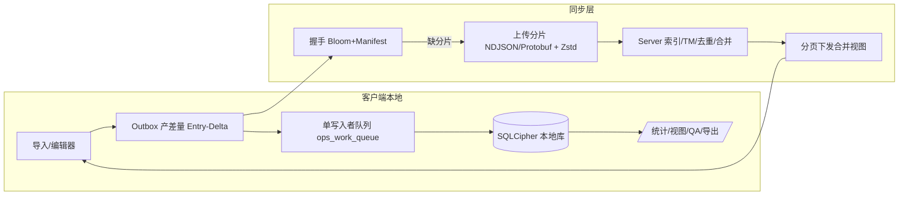

# MC L10n V6 数据库架构设计

## 📋 概述

基于V6架构设计的MC L10n数据库系统，实现实体解耦、分层命名、键级差量同步等核心特性。

**设计原则**：
- 实体解耦：Pack、MOD、语言文件作为一等实体
- 数据库分层：`core_*`/`ops_*`/`cache_*`/`cfg_*` 命名规范
- 单写入者模型 + 工作队列机制
- 键级差量同步 + 内容寻址

## 🏗️ 核心架构



## 🗄️ 数据库表结构

### 3.1 核心域 core_*

#### core_projects
```sql
CREATE TABLE core_projects (
    id INTEGER PRIMARY KEY AUTOINCREMENT,
    uid TEXT UNIQUE NOT NULL,
    name TEXT NOT NULL,
    description TEXT,
    created_at TEXT NOT NULL,
    updated_at TEXT NOT NULL
);
```

#### core_packs（整合包）
```sql
CREATE TABLE core_packs (
    id INTEGER PRIMARY KEY AUTOINCREMENT,
    uid TEXT UNIQUE NOT NULL,
    platform TEXT CHECK(platform IN ('modrinth','curseforge','custom')) NOT NULL,
    slug TEXT NOT NULL,
    title TEXT NOT NULL,
    author TEXT,
    homepage TEXT,
    created_at TEXT NOT NULL,
    updated_at TEXT NOT NULL
);
```

#### core_pack_versions
```sql
CREATE TABLE core_pack_versions (
    id INTEGER PRIMARY KEY AUTOINCREMENT,
    uid TEXT UNIQUE NOT NULL,
    pack_uid TEXT NOT NULL REFERENCES core_packs(uid),
    mc_version TEXT NOT NULL,
    loader TEXT CHECK(loader IN ('forge','neoforge','fabric','quilt','multi','unknown')) NOT NULL,
    manifest_json TEXT CHECK(json_valid(manifest_json)),
    manifest_hash_b3 TEXT NOT NULL,
    manifest_hash_md5 TEXT,
    created_at TEXT NOT NULL
);
```

#### core_pack_items（清单条目）
```sql
CREATE TABLE core_pack_items (
    id INTEGER PRIMARY KEY AUTOINCREMENT,
    pack_version_uid TEXT NOT NULL REFERENCES core_pack_versions(uid),
    item_type TEXT CHECK(item_type IN ('mod','resourcepack','datapack','override')) NOT NULL,
    source_platform TEXT CHECK(source_platform IN ('modrinth','curseforge','url','local')) NOT NULL,
    identity TEXT NOT NULL,
    constraints TEXT CHECK(json_valid(constraints)),
    position INTEGER NOT NULL,
    created_at TEXT NOT NULL,
    UNIQUE(pack_version_uid, item_type, identity)
);
```

#### core_pack_installations（本地实例）
```sql
CREATE TABLE core_pack_installations (
    id INTEGER PRIMARY KEY AUTOINCREMENT,
    uid TEXT UNIQUE NOT NULL,
    pack_version_uid TEXT NOT NULL REFERENCES core_pack_versions(uid),
    root_path TEXT,
    launcher TEXT CHECK(launcher IN ('curseforge','modrinth','vanilla','custom')),
    enabled BOOLEAN DEFAULT TRUE,
    created_at TEXT NOT NULL,
    updated_at TEXT NOT NULL
);
```

#### core_mods
```sql
CREATE TABLE core_mods (
    id INTEGER PRIMARY KEY AUTOINCREMENT,
    uid TEXT UNIQUE NOT NULL,
    modid TEXT UNIQUE,
    slug TEXT,
    name TEXT NOT NULL,
    homepage TEXT,
    created_at TEXT NOT NULL,
    updated_at TEXT NOT NULL
);
```

#### core_mod_versions
```sql
CREATE TABLE core_mod_versions (
    id INTEGER PRIMARY KEY AUTOINCREMENT,
    uid TEXT UNIQUE NOT NULL,
    mod_uid TEXT NOT NULL REFERENCES core_mods(uid),
    loader TEXT NOT NULL,
    mc_version TEXT NOT NULL,
    version TEXT NOT NULL,
    meta_json TEXT CHECK(json_valid(meta_json)),
    source TEXT,
    discovered_at TEXT NOT NULL,
    UNIQUE(mod_uid, loader, mc_version, version)
);
```

#### core_language_files
```sql
CREATE TABLE core_language_files (
    id INTEGER PRIMARY KEY AUTOINCREMENT,
    uid TEXT UNIQUE NOT NULL,
    carrier_type TEXT CHECK(carrier_type IN ('mod','resource_pack','data_pack','override')) NOT NULL,
    carrier_uid TEXT NOT NULL,
    locale TEXT NOT NULL,
    rel_path TEXT NOT NULL,
    format TEXT CHECK(format IN ('json','lang','properties')) NOT NULL,
    size INTEGER DEFAULT 0,
    discovered_at TEXT NOT NULL,
    UNIQUE(carrier_uid, locale, rel_path)
);
```

#### core_translation_entries
```sql
CREATE TABLE core_translation_entries (
    id INTEGER PRIMARY KEY AUTOINCREMENT,
    uid TEXT UNIQUE NOT NULL,
    language_file_uid TEXT NOT NULL REFERENCES core_language_files(uid),
    key TEXT NOT NULL,
    src_text TEXT NOT NULL,
    dst_text TEXT DEFAULT '',
    status TEXT CHECK(status IN ('new','mt','reviewed','locked','rejected','conflict')) DEFAULT 'new',
    qa_flags TEXT CHECK(json_valid(qa_flags)) DEFAULT '{}',
    updated_at TEXT NOT NULL,
    UNIQUE(language_file_uid, key)
);
```

### 3.2 运维与同步 ops_*

#### ops_work_queue
```sql
CREATE TABLE ops_work_queue (
    id INTEGER PRIMARY KEY AUTOINCREMENT,
    type TEXT CHECK(type IN ('import_delta_block','export_stream','tm_index','qa_run','merge_resolve','sync_out','sync_in')) NOT NULL,
    payload_json TEXT CHECK(json_valid(payload_json)) NOT NULL,
    state TEXT CHECK(state IN ('pending','leased','done','err','dead')) DEFAULT 'pending',
    priority INTEGER DEFAULT 0,
    not_before TEXT,
    dedupe_key TEXT UNIQUE,
    attempt INTEGER DEFAULT 0,
    last_error TEXT,
    lease_owner TEXT,
    lease_expires_at TEXT,
    created_at TEXT NOT NULL,
    updated_at TEXT NOT NULL
);
```

#### ops_outbox_journal
```sql
CREATE TABLE ops_outbox_journal (
    id INTEGER PRIMARY KEY AUTOINCREMENT,
    entity_uid TEXT NOT NULL,
    entity_type TEXT NOT NULL,
    base_version TEXT,
    diff_json TEXT CHECK(json_valid(diff_json)) NOT NULL,
    idempotency_key TEXT UNIQUE NOT NULL,
    state TEXT CHECK(state IN ('pending','sent','acked','err')) DEFAULT 'pending',
    created_at TEXT NOT NULL,
    updated_at TEXT NOT NULL
);
```

#### ops_sync_log
```sql
CREATE TABLE ops_sync_log (
    id INTEGER PRIMARY KEY AUTOINCREMENT,
    direction TEXT CHECK(direction IN ('up','down')) NOT NULL,
    endpoint TEXT NOT NULL,
    request_meta TEXT CHECK(json_valid(request_meta)),
    response_meta TEXT CHECK(json_valid(response_meta)),
    result TEXT CHECK(result IN ('success','fail','partial')) NOT NULL,
    idempotency_key TEXT,
    created_at TEXT NOT NULL
);
```

#### ops_cas_objects
```sql
CREATE TABLE ops_cas_objects (
    cid TEXT PRIMARY KEY,
    size INTEGER NOT NULL,
    algo TEXT CHECK(algo IN ('zstd','gzip','none')) DEFAULT 'zstd',
    dict_id TEXT,
    ref_count INTEGER DEFAULT 1,
    created_at TEXT NOT NULL
);
```

### 3.3 配置与缓存

#### cfg_local_settings
```sql
CREATE TABLE cfg_local_settings (
    key TEXT PRIMARY KEY,
    value_json TEXT CHECK(json_valid(value_json)) NOT NULL,
    updated_at TEXT NOT NULL
);
```

#### cfg_file_watch
```sql
CREATE TABLE cfg_file_watch (
    id INTEGER PRIMARY KEY AUTOINCREMENT,
    root_path TEXT NOT NULL,
    globs TEXT CHECK(json_valid(globs)) NOT NULL,
    active BOOLEAN DEFAULT TRUE,
    created_at TEXT NOT NULL
);
```

#### cache_scan_results
```sql
CREATE TABLE cache_scan_results (
    id INTEGER PRIMARY KEY AUTOINCREMENT,
    scan_path TEXT NOT NULL,
    scan_hash TEXT NOT NULL,
    result_json TEXT CHECK(json_valid(result_json)) NOT NULL,
    valid_until TEXT NOT NULL,
    created_at TEXT NOT NULL,
    UNIQUE(scan_path, scan_hash)
);
```

## 📊 索引设计

```sql
-- 核心索引
CREATE INDEX idx_translation_entries_file_key ON core_translation_entries(language_file_uid, key);
CREATE INDEX idx_language_files_carrier ON core_language_files(carrier_type, carrier_uid, locale);
CREATE INDEX idx_mod_versions_lookup ON core_mod_versions(mod_uid, loader, mc_version, version);
CREATE INDEX idx_pack_items_lookup ON core_pack_items(pack_version_uid, item_type, identity);

-- 工作队列索引
CREATE INDEX idx_work_queue_state ON ops_work_queue(state, not_before, priority);
CREATE UNIQUE INDEX idx_work_queue_dedupe ON ops_work_queue(dedupe_key) WHERE dedupe_key IS NOT NULL;

-- 同步索引
CREATE INDEX idx_outbox_state ON ops_outbox_journal(state, created_at);
CREATE INDEX idx_cas_objects_cid ON ops_cas_objects(cid);

-- 时间戳索引
CREATE INDEX idx_translation_entries_updated ON core_translation_entries(updated_at);
```

## 🔍 数据库视图

```sql
-- 缓存统计视图
CREATE VIEW v_cache_statistics AS
SELECT 
    'scan_results' as cache_type,
    COUNT(*) as total_entries,
    COUNT(CASE WHEN valid_until > datetime('now') THEN 1 END) as valid_entries,
    ROUND(AVG(LENGTH(result_json)), 2) as avg_size_bytes
FROM cache_scan_results;

-- 队列状态视图  
CREATE VIEW v_queue_status AS
SELECT 
    state,
    COUNT(*) as count,
    MIN(created_at) as oldest_created,
    MAX(updated_at) as latest_updated
FROM ops_work_queue 
GROUP BY state;

-- 同步历史视图
CREATE VIEW v_sync_history AS
SELECT 
    direction,
    result,
    COUNT(*) as count,
    MAX(created_at) as latest_sync
FROM ops_sync_log
WHERE created_at > datetime('now', '-7 days')
GROUP BY direction, result;

-- 差量积压视图
CREATE VIEW v_delta_backlog AS
SELECT 
    entity_type,
    state,
    COUNT(*) as count,
    MIN(created_at) as oldest_pending
FROM ops_outbox_journal
GROUP BY entity_type, state;
```

## 🔐 SQLCipher 配置

```sql
-- 安全配置
PRAGMA cipher_page_size = 4096;
PRAGMA cipher_kdf_algorithm = PBKDF2_HMAC_SHA512;
PRAGMA cipher_hmac_algorithm = HMAC_SHA512;
PRAGMA kdf_iter = 20000;

-- 性能配置
PRAGMA journal_mode = WAL;
PRAGMA synchronous = NORMAL;
PRAGMA busy_timeout = 5000;
PRAGMA cache_size = -64000; -- 64MB
PRAGMA temp_store = MEMORY;
```

## 📈 性能目标

- **扫描速度**: ~10 MODs/秒
- **API响应**: p95 < 120ms
- **同步效率**: 日更1% < 1.5MB/批
- **缓存命中**: > 90%
- **队列滞后**: < 100ms
- **失败重试**: < 1%

---

**版本**: V6.0  
**创建时间**: 2025-09-10  
**状态**: 🚀 设计完成