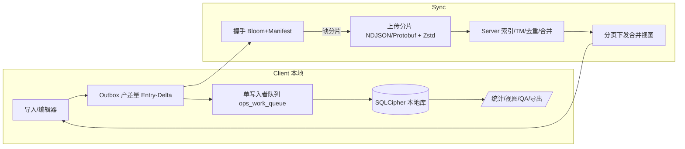
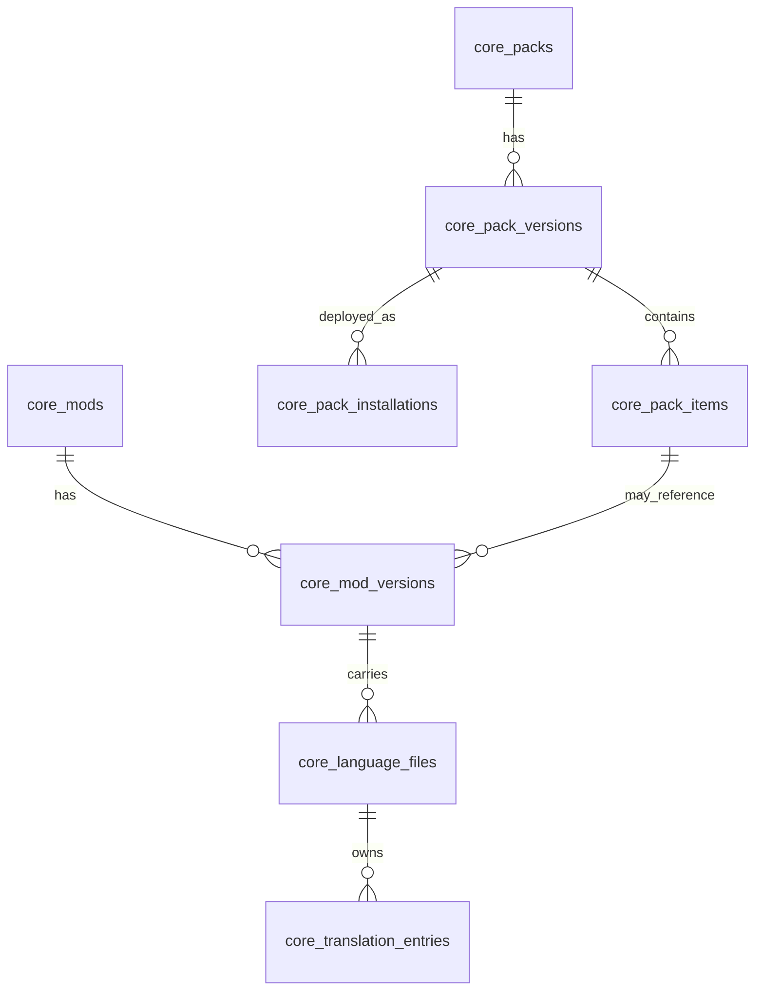
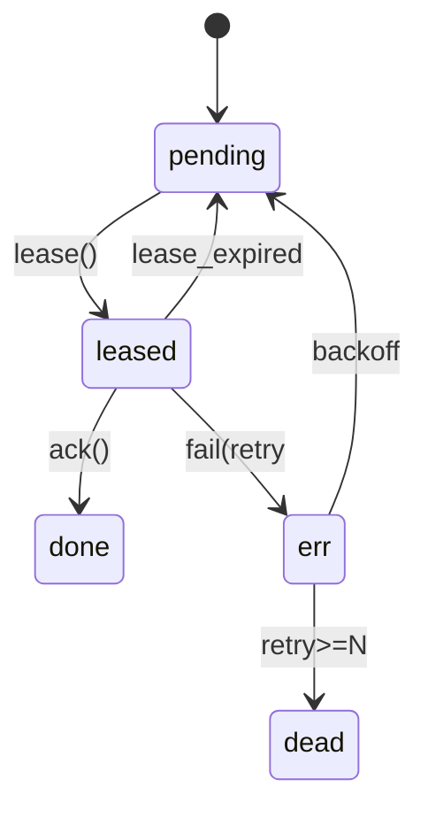

泽海，按你最新边界（**只处理抽取后的结构化数据：整合包信息、MOD 信息、语言词条；不涉及 JAR/ZIP/二进制容器**），我把前面所有讨论**整合为一份「V5 全面版 SSOT」**。不写代码，拍板即能开干。

---

# 0️⃣ 结论（拍板要点）

* **实体解耦**：整合包（Pack/PackVersion/PackItem/Installation）、MOD（Mod/ModVersion）、语言文件与词条（LanguageFile/TranslationEntry）为**一等实体**，互相用关系表关联；**不要把 Pack 当 MOD 存**。
* **数据库分层命名**：`core_*`（事实源）/`ops_*`（队列与同步）/`cache_*`（可再生缓存）/`cfg_*`（本地配置）。
* **本地库 SQLCipher**：整库加密，页 4096、WAL、`synchronous=NORMAL`；密钥优先 OS Keyring，备选主口令+PBKDF2-SHA512（≥20000）。
* **单写入者模型**：所有写操作经 `ops_work_queue` 串行落库；扫描导入与同步并发仅产**事件分片**。
* **同步协议**：键级差量（Entry-Delta）+ Bloom 握手 + 内容寻址（`cid=BLAKE3(payload)`）；传输帧为 **NDJSON 流（默认）** 或 **Protobuf**，外层 **Zstd-6** 压缩，可配**按语言字典**。
* **上下行都支持断点续传与幂等键**；重复文本强去重（CAS + TM 命中），只传增量。
* **下载统一返回“合并视图”分页流**（不打包、不生成容器），由你的后续流水线决定如何落地资源包。
* **性能目标（SLO）**：百万级键，1% 日更，上/下行常规批次 0.5–1.5 MB；API p95 < 120 ms；失败重试率 < 1%。
* **QA 与冲突**：`key/src_text` 默认锁定；`dst_text/status/qa_flags` 走 3-way merge，冲突保留双版入待审。
* **观测与回滚**：指标内建到 `/api/v5/database/statistics`；影子库与只读兼容层可选（你当前场景为“直接重构”，可先不启用）。

---

# 1️⃣ 边界与前置假设

* 数据来源是**已抽取的结构化文本**：Pack 清单、MOD 元信息字段、语言文件键值对；**不存储也不生成任何容器型文件**。
* 允许 HTTP 传输层压缩与二进制序列化，仅为省流与性能；事实源仍是结构化数据表。
* 跨端稳定标识采用 **UIDA**（namespace+keys+project\_id），覆盖核心实体，确保幂等与合并。

---

# 2️⃣ 顶层架构（组件与数据流）

---

# 3️⃣ 数据域与数据库设计（SSOT，无 SQL）

> 类型缩写：`UID=字符串`，`TS=ISO8601 文本`，`JSON=SQLite json_valid 约束`。必要唯一性与外键在说明中给出。

## 3.1 核心域 core\_\*

### core\_projects

* `id PK`、`uid UNIQUE`、`name`、`description`、`created_at TS`、`updated_at TS`.

### core\_packs（整合包）

* `id PK`、`uid UNIQUE`、`platform enum(modrinth|curseforge|custom)`、`slug`、`title`、`author`、`homepage`、`created_at TS`、`updated_at TS`.

### core\_pack\_versions

* `id PK`、`uid UNIQUE`、`pack_uid FK(core_packs.uid)`、`mc_version`、`loader enum(forge|neoforge|fabric|quilt|multi|unknown)`、`manifest_json JSON`、`manifest_hash_b3`、`manifest_hash_md5`、`created_at TS`.

### core\_pack\_items（清单条目＝期望集）

* `id PK`、`pack_version_uid FK`、`item_type enum(mod|resourcepack|datapack|override)`、`source_platform enum(modrinth|curseforge|url|local)`、`identity`（projectID/fileID/url 等）、`constraints JSON`、`position INTEGER`、`created_at TS`.
* 约束：`UNIQUE(pack_version_uid, item_type, identity)`。

### core\_pack\_installations（本地“实例”）

* `id PK`、`uid UNIQUE`、`pack_version_uid FK`、`root_path`（逻辑标识，可空）、
  `launcher enum(curseforge|modrinth|vanilla|custom)`、`enabled BOOLEAN`、`created_at TS`、`updated_at TS`.

### core\_mods

* `id PK`、`uid UNIQUE`、`modid`（namespace，可空唯一）、
  `slug`、`name`、`homepage`、`created_at TS`、`updated_at TS`.

### core\_mod\_versions（来自抽取的元数据字段，非文件哈希）

* `id PK`、`uid UNIQUE`、`mod_uid FK(core_mods.uid)`、`loader`、`mc_version`、`version`（semver 或文本）、`meta_json JSON`、`source`（来自何清单/来源）、`discovered_at TS`.
* 可选唯一性：`UNIQUE(mod_uid, loader, mc_version, version)`。

### core\_language\_files（语言文件载体的逻辑表示）

* `id PK`、`uid UNIQUE`、`carrier_type enum(mod|resource_pack|data_pack|override)`、
  `carrier_uid`（如 `core_mod_versions.uid` 或虚拟资源载体 UID）、`locale`（小写下划线，例 `zh_cn`）、`rel_path`（相对路径逻辑名）、`format enum(json|lang|properties)`、`size INTEGER`（字符数或条目数）、`discovered_at TS`.
* 约束：`UNIQUE(carrier_uid, locale, rel_path)`。

### core\_translation\_entries（键级事实）

* `id PK`、`uid UNIQUE`、`language_file_uid FK`、`key`、`src_text`、`dst_text`、
  `status enum(new|mt|reviewed|locked|rejected|conflict)`、`qa_flags JSON`、`updated_at TS`.
* 约束：`UNIQUE(language_file_uid, key)`。

> 说明：资源包覆盖链不在 DB 做去重，由服务层依据加载顺序合并。

## 3.2 运维与同步 ops\_\*

### ops\_work\_queue（单写入者任务）

* `id PK`、`type enum(import_delta_block|export_stream|tm_index|qa_run|merge_resolve|sync_out|sync_in)`、
  `payload_json JSON`、`state enum(pending|leased|done|err|dead)`、
  `priority INTEGER`、`not_before TS`、`dedupe_key UNIQUE`、
  `attempt INTEGER`、`last_error`、`lease_owner`、`lease_expires_at TS`、
  `created_at TS`、`updated_at TS`.

### ops\_outbox\_journal（离线变更，键级差量）

* `id PK`、`entity_uid`（指向 `core_translation_entries.uid` 等）、
  `entity_type`、`base_version`（或 `base_hash`）、`diff_json JSON`、
  `idempotency_key UNIQUE`、`state enum(pending|sent|acked|err)`、
  `created_at TS`、`updated_at TS`.

### ops\_sync\_log

* `id PK`、`direction enum(up|down)`、`endpoint`、`request_meta JSON`、`response_meta JSON`、
  `result enum(success|fail|partial)`、`idempotency_key`、`created_at TS`.

### ops\_cas\_objects（分片去重索引）

* `cid PK`（`BLAKE3(payload)`）、`size INTEGER`、`algo enum(zstd|gzip|none)`、
  `dict_id`、`ref_count INTEGER`、`created_at TS`.

## 3.3 配置与缓存

* **cfg\_local\_settings**：`key PK`、`value_json JSON`、`updated_at TS`.
* **cfg\_file\_watch**：`id PK`、`root_path`、`globs JSON`、`active BOOLEAN`、`created_at TS`.
* **cache\_scan / cache\_lang\_file / cache\_entry / cache\_stats**：含 `valid_until TS`，仅可再生数据。

## 3.4 关系总览（ER 图）

> 说明：`core_pack_items → core_mod_versions` 通过解析抽取的“版本字段”或映射表建立逻辑关联。

---

# 4️⃣ 索引与视图（首批 ≤8 个索引）

* 必备索引

  1. `core_translation_entries (language_file_uid, key)`
  2. `core_language_files (carrier_type, carrier_uid, locale)`
  3. `core_mod_versions (mod_uid, loader, mc_version, version)`
  4. `core_pack_items (pack_version_uid, item_type, identity)`
  5. `ops_work_queue (state, not_before, priority)`
  6. `ops_work_queue (dedupe_key) UNIQUE`
  7. `ops_outbox_journal (state, created_at)`
  8. `ops_cas_objects (cid)`

* 典型视图

  * `v_cache_statistics`（缓存命中、失效）
  * `v_queue_status`（队列深度、滞后、失败率）
  * `v_sync_history`（最近同步吞吐）
  * `v_delta_backlog`（待上行/待下行增量）

---

# 5️⃣ 同步协议（纯结构化数据）

## 5.1 握手（Bloom + 能力协商）

* **请求**：`POST /api/v5/sync/handshake`

  * `client_cap`: `{zstd: true, dict_ids: ["zh_cn@2025-09"]}`
  * `bloom`: `{k, m, hashes}`（客户端已存 `cid` 集合）
  * `scope`: `{locale, project_uid|pack_uid}`
* **响应**：`{session_id, missing_cids: [...], dict_advice: [...], limits: {max_chunk_mb: 2}}`

## 5.2 上行分片（Entry-Delta Block）

* **传输格式**：默认 **NDJSON 流**，一行一条 `entry-delta`；可选 Protobuf 帧。
* **分片大小**：未压缩 1–2 MB；外层 `Content-Encoding: zstd`；头 `X-Idempotency-Key: <cid>`。
* **Delta 字段**：

  * `entry_uid`、`language_file_uid`、`key`
  * `base_version`（或 `base_hash`）
  * `changes`: `{dst_text?, status?, qa_flags?}`
  * `ts`（客户端时间，服务端以逻辑时钟落库）
* **续传**：支持 `Range/Offset` 语义；服务端返回 `received_bytes`。

## 5.3 下行导出（合并视图）

* `GET /api/v5/export/ndjson?locale=...&carrier=mod|resource_pack|data_pack|override&after=...&limit=...`
* 响应为 **流式 NDJSON** 或 **Protobuf**，每条含：

  * `language_file_uid`, `key`, `src_text`, `dst_text`, `status`, `qa_flags`, `version`, `updated_at`
  * 覆盖链与加载顺序在分页元数据或并行 `GET /language-files` 返回。

## 5.4 冲突与合并

* **3-way merge**：`base/local/remote`，字段级；`src_text/key` 默认锁定。
* 合并失败 → 标 `conflict` 并保留两版；进入审核列表。
* 幂等键：`hash(entry_uid + base + diff)`；服务端幂等窗口建议 60 分钟。

---

# 6️⃣ 工作队列与 Outbox（状态机）

* **ops\_work\_queue 关键字段**：`dedupe_key` 去重、`lease_owner` 与 `lease_expires_at` 租约、`attempt` 重试计数。
* **任务切分**：`import_delta_block`（1–2 MB 分片）→ `merge_resolve`（按 file/locale）→ `qa_run` → `tm_index`.
* **Outbox**：本地变更即刻记录 `ops_outbox_journal`，上行成功记 `acked`；失败留 `err` 待重试。

---

# 7️⃣ SQLCipher 与安全（本地库）

* **密钥管理**：优先 OS Keyring；备选主口令 + PBKDF2-HMAC-SHA512（≥20000，salt ≥16 B）。
* **PRAGMA 建议**：

  * `cipher_page_size=4096`
  * `cipher_kdf_algorithm=PBKDF2_HMAC_SHA512`
  * `cipher_hmac_algorithm=HMAC_SHA512`
  * `kdf_iter>=20000`
  * `journal_mode=WAL`、`synchronous=NORMAL`、`busy_timeout>=5000`
* **密钥轮换**：就地重加密；轮换日志入 `ops_sync_log`，不落明文。
* **备份**：仅备加密库；日志不含机密字段；崩溃转储清理敏感片段。

---

# 8️⃣ 缓存与省流策略

* **多层缓存**：内存 LRU（最近 1k 语言文件或键空间）+ DB `cache_*`（含 `valid_until`）+ 磁盘轻量 JSON（可选）。
* **只传变化**：Outbox 记录 `dst_text/status/qa_flags` 增量；服务端 TM 命中优先，减少 MT 调用。
* **压缩**：默认 `zstd-6`；按 `locale` 使用领域字典（如 `zh_cn@2025-09`），压缩比显著提升。
* **规范化**：Canonical JSON 或稳定 Protobuf 编码，确保跨端 `cid` 一致。

---

# 9️⃣ 监控与指标（API 可观测）

* `/api/v5/database/statistics` 返回：

  * **同步**：分片大小均值/中位、Bloom 缺失率、CAS 命中率、上/下行吞吐、失败重试率
  * **DB**：`page_count`、`freelist`、`wal_frames`、`cache_hit`、`busy_retries`
  * **队列**：深度、滞后、`err/dead` 比例、平均处理时延
  * **QA**：占位符不一致率、空串率、重复键率
* 日志字段：`event, entity_uid, job_id, duration_ms, rows, hit_miss, attempt, cid`.

---

# 🔟 API v5 路由要点（摘要）

* **同步**

  * `POST /sync/handshake`
  * `PUT /sync/chunk/{cid}`（NDJSON/Protobuf 分片，续传）
  * `POST /sync/commit`（会话提交与结果）

* **导出**

  * `GET /export/ndjson` 或 `/export/pb`（分页、范围）
  * `GET /database/statistics`

* **管理**

  * `GET /packs /pack-versions /pack-items`
  * `GET /mods /mod-versions`（来自抽取元数据）
  * `GET /language-files?carrier=...&locale=...`
  * `GET /translations?language_file_uid=...&after=...&limit=...`
  * `PUT /translations/{entry_uid}`（If-Match + Idempotency-Key）

> 统一分页：`limit/offset` 或 `since_id` 二选一；统一返回 `X-TH-DB-Schema` 与 `ETag/If-Match`。

---

# 1️⃣1️⃣ QA 规则与合并策略

* **占位符一致**：`%s/%d/{0}` 集合相等；顺序不强制但数量与类型需一致。
* **转义合法**：禁止悬空反斜杠；`\n \t \\ \"` 等成对。
* **空值策略**：空字符串标 `rejected` 或 `needs_review`。
* **锁字段**：`key/src_text` 默认锁定；特权接口方可更新。
* **覆盖链**：按 `resource_pack > mod > data_pack > override` 或你的既定顺序；合并在服务层完成。

---

# 1️⃣2️⃣ 性能目标与基准

* **目标**：

  * 首次全量下行（合并视图）zstd 后 5–20 MB
  * 日更 1% 上行 delta zstd 后 0.5–1.5 MB/批
  * API p95 < 120 ms、断点续传成功率 ≥ 99.9%、失败重试率 < 1%
* **基准集**：小（10k 键）/中（100k 键）/大（1M 键），测 p50/p95 时延、吞吐、Bloom 缺失率、压缩比、队列滞后。

---

# 1️⃣3️⃣ 风险与应对

* **JSON 顺序差异导致幂等失败**：统一 Canonical JSON 或 Protobuf；以规范化后字节流计算 `cid`。
* **小分片过多**：聚合为 1–2 MB 再上传，降低握手与队列压力。
* **字典不匹配**：握手返回 `dict_id` 白名单；客户端按建议选择。
* **SQLite Busy**：单写入者 + WAL + `busy_timeout>=5000`；写入仅来自队列消费者。
* **冲突放大**：锁定 `key/src_text`，增量只动 `dst_text/status/qa_flags`；3-way 冲突入待审。
* **安全**：只备加密库；日志脱敏；不把机密写入 crash dump。

---

# 1️⃣4️⃣ 实施步骤与检查清单（不写代码）

## P0：三天内

* 冻结**领域 SSOT**（本文件第 3 节）与**协议参数**（分片 2 MB、并发 4、Zstd-6、Bloom m≈1 MiB/k=7、BLAKE3）。
* 定版**队列状态机**与 `dedupe_key/lease` 规则。
* 定版**导出合并视图字段**与分页语义。
* 训练 `zh_cn/en_us` 的 Zstd 字典，出 `dict_id` 与哈希。

## P1：一周内

* 打通**握手→上传分片→断点续传→幂等校验→落库**闭环。
* 打通**分页导出**与客户端合并视图闭环。
* 接通**TM/术语**命中与**QA 校验**最小集。
* 暴露**统计指标**与 CLI 最小命令：`sync`, `export`, `stats`.

## 验收（建议）

* 全量导出 ≤ 20 MB；日常增量 ≤ 1.5 MB；API p95 < 120 ms；失败重试率 < 1%。

---

# 1️⃣5️⃣ 取舍对比（为何这样做）

* **键级差量 vs 文件级**：你的数据即键级文本，键级合并天然、最小、可观测；文件级会引入无意义差异。
* **NDJSON 流 vs 压缩包**：流式可边产边传、断点续传粒度细，不需要容器文件；配 Zstd 与字典已足够省流。
* **单写入者**：SQLite/SQLCipher 的稳定写入模式；并发写会引出 Busy 与死锁。
* **UIDA**：跨端稳定主键，幂等、重放、冲突归因都简单可靠。
